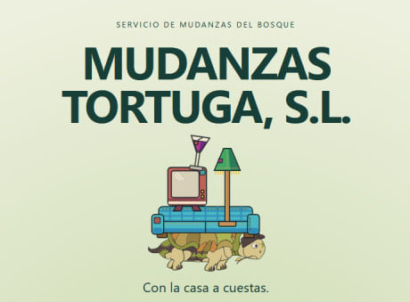

<div align="center">

# 🐢 MUDANZAS TORTUGA, S.L.

### *Servicio de Mudanzas de Don Tortuga para criaturillas del bosque desahuciadas*

**Equilibra la carga. Lee el terreno. Salva hasta el último vaso.**

<br>


<br><br>



<br>

> **«Te llevamos a tu nuevo hogar con la casa a cuestas.»**

**Anima Valencia Game Jam 2026 · FICIV Valencia**

</div>

---

## 🌲 ¿Qué es?

**Mudanzas Tortuga, S.L.** es un juego 2D de físicas simplificadas para navegador en el que Don Tortuga intenta completar una mudanza atravesando un bosque cada vez menos hospitalario.

Don Tortuga no tiene barra de vida. No explota. No se rompe. No abandona.

La que corre peligro es **la mudanza**.

El jugador regula la velocidad de avance e inclina el caparazón para intentar conservar una montaña precaria de muebles, cachivaches y objetos absurdamente delicados mientras atraviesa desniveles, impactos, trampas, cambios de terreno y agua.

```text
          🪔
         [TV]      «Todo controlado.»
      🥂 [CAJA]           \
       [SOFÁ]             🐢  → → →
══════════════════════════════════════
```

La meta no es llegar intacto.

La meta es **llegar con todo lo que todavía sea posible salvar**.

Este proyecto es nuestro juego para la [Anima Valencia Game Jam 2026](https://raccreativegames.com/es/jams/anima-valencia-26), celebrada dentro del **Festival Internacional de Cine Infantil de Valencia (FICIV)**, con el tema **«tortuga»**.

**Autores:**

- **Mike Fieldins** — <https://github.com/s1vh>
- **Argorias Svartha** — <https://www.artstation.com/argorias>

---

## 🧠 Retos y lecciones aprendidas

Desarrollar **Mudanzas Tortuga, S.L.** en el contexto de una game jam, siendo solamente dos personas, nos obligó a priorizar muy bien qué construir, cómo validarlo y en qué orden.

Uno de los mayores aciertos del proyecto ha sido apoyarnos en un enfoque de trabajo inspirado en **Spec-Driven Development (SDD)**, pero adaptado a la realidad de una jam: alcance acotado, decisiones rápidas y documentación lo bastante clara como para acelerar el desarrollo sin ahogarlo.

Gracias a ello hemos podido:

- **Acelerar la implementación** al trabajar sobre especificaciones concretas en lugar de improvisar sistemas enteros sobre la marcha.
- **Sistematizar el testing** de la física del juego, algo especialmente importante en una propuesta donde el núcleo jugable depende del equilibrio de la carga, las colisiones y el comportamiento del terreno.
- **Validar el diseño procedural** con criterios claros, reduciendo el riesgo de *softlocks* y asegurando que la generación de módulos siga siendo jugable.
- **Iterar más deprisa con placeholders funcionales**, usando figuras simplificadas y arte provisional para cerrar primero la lógica, el tuning y la legibilidad antes de rematar el acabado final.

En otras palabras: hemos intentado que incluso dentro del caos normal de una game jam, el desarrollo conserve una base sólida, comprobable y razonablemente escalable.

---

## 💻 Ejecutar en local

Si solo quieres levantar una versión local rápida usando el **script auxiliar en Python**, desde la raíz del repositorio:

### 1) Instalar dependencias

```bash
npm ci
```

### 2) Generar el build

```bash
npm run build
```

### 3) Servir `dist/` con el helper de Python

```bash
python scripts/localServer.py --directory dist --port 4173
```

Si en tu sistema el intérprete es `python3` o `py -3`, usa una de estas variantes:

```bash
python3 scripts/localServer.py --directory dist --port 4173
```

```powershell
py -3 scripts/localServer.py --directory dist --port 4173
```

### 4) Abrir en el navegador

- Menú principal: <http://127.0.0.1:4173/>
- Laboratorio de físicas: <http://127.0.0.1:4173/?mode=physics>

> Si necesitas el flujo completo de desarrollo, preview o despliegue, la guía detallada está en `docs/DEPLOYMENT.md`.

---

## 📚 Documentación

### Diseño y planificación
- [`docs/GDD.md`](docs/GDD.md) — documento de diseño del juego y fuente de verdad.
- [`docs/PRD.md`](docs/PRD.md) — requisitos técnicos, arquitectura y alcance.
- [`docs/BACKLOG.md`](docs/BACKLOG.md) — prioridades, tareas y seguimiento.

### Implementación
- [`docs/PHYSICS.md`](docs/PHYSICS.md) — arquitectura de físicas, tuning y validación.
- [`docs/ENDLESS_PLAN.md`](docs/ENDLESS_PLAN.md) — plan de implementación y comprobación de la Carrera Infinita.
- [`docs/BACKEND.md`](docs/BACKEND.md) — servicios locales y evolución futura.
- [`docs/DEPLOYMENT.md`](docs/DEPLOYMENT.md) — builds, servidor local y despliegue.

### Assets y audio
- [`docs/ASSETS.md`](docs/ASSETS.md) — guía de arte y contrato técnico para assets.
- [`docs/SOUNDS.md`](docs/SOUNDS.md) — selección de música y efectos, con su integración en el juego.

### Operativa del proyecto
- [`AGENTS.md`](AGENTS.md) — mapa operativo para agentes y asistentes.
- [`CONTRIBUTING.md`](CONTRIBUTING.md) — metodología de trabajo y flujo Git.
- [`LICENSE.md`](LICENSE.md) — licencias del código, arte y audio.

---

<div align="center">

### 🐢 Mudanzas Tortuga, S.L.

**Lento no significa tarde.**

</div>
