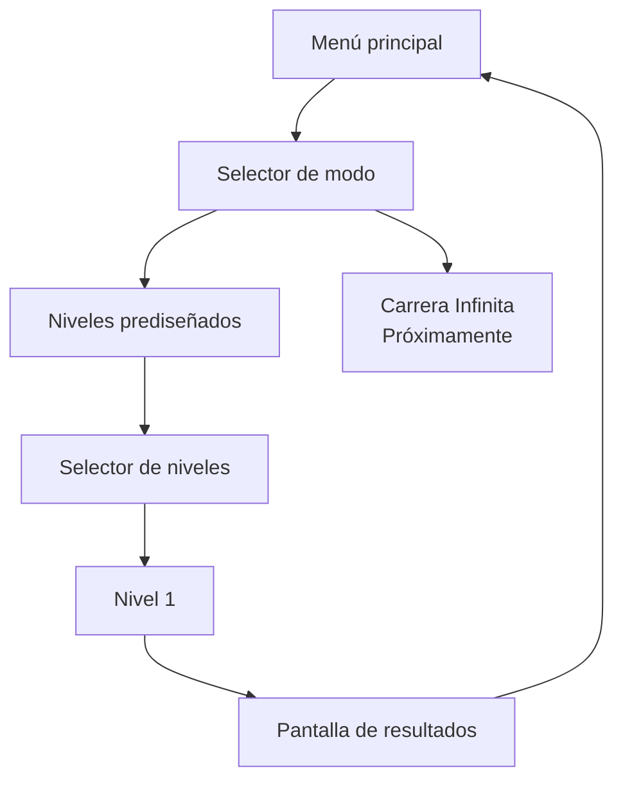

<div align="center">

# 🐢 MUDANZAS TORTUGA, S.L.

### *Servicio de Mudanzas de Don Tortuga para criaturillas del bosque desahuciadas*

**Equilibra la carga. Lee el terreno. Salva hasta el último vaso.**

<br>


<br>


<br><br>

> **«Te llevamos a tu nuevo hogar con la casa a cuestas.»**

**Anima Valencia Game Jam 2026 · FICIV Valencia**

</div>

---

## 🌲 ¿Qué es?

**Mudanzas Tortuga, S.L.** es un juego 2D de físicas simplificadas para navegador en el que Don Tortuga intenta completar una mudanza atravesando un bosque cada vez menos hospitalario.

Don Tortuga no tiene barra de vida. No explota. No se rompe. No abandona.

La que corre peligro es **la mudanza**.

El jugador regula la velocidad de avance e inclina el caparazón para intentar conservar una montaña precaria de muebles, cachivaches y objetos absurdamente delicados mientras atraviesa desniveles, impactos, trampas, cambios de terreno y agua.

```text
          🪔
         [TV]      «Todo controlado.»
      🥂 [CAJA]           \
       [SOFÁ]             🐢  → → →
══════════════════════════════════════
```

La meta no es llegar intacto.

La meta es **llegar con todo lo que todavía sea posible salvar**.

---

## 🎬 Anima Valencia Game Jam 2026

Esta versión se desarrolla para la **Anima Valencia Game Jam 2026**, celebrada dentro del **Festival Internacional de Cine Infantil de Valencia (FICIV)**, con el tema **«tortuga»**.

Página oficial del evento: <https://raccreativegames.com/es/jams/anima-valencia-26>

El objetivo mínimo de la jam incluye:

| | Objetivo |
|---|---|
| 🐢 | 1 configuración de Don Tortuga y su montaña de objetos |
| 📦 | 4 tipos de objeto físicamente diferentes |
| 🗺️ | 1 nivel prediseñado construido mediante módulos reutilizables |
| 🌊 | Al menos 3 biomas, incluyendo agua |
| ⚠️ | Al menos 2 tipos de trampa; 3 como objetivo |
| 🏁 | Meta, puntuación y pantalla de resultados |
| ♾️ | Carrera Infinita visible como **«Próximamente»** si no llega a implementarse |

El diseño completo vive en [`/docs/GDD.md`](docs/GDD.md).

---

## 🕹️ Controles

### Terreno seco

| Tecla | Acción |
|---|---|
| `→` / `D` | Acelerar dentro del rango permitido |
| `←` / `A` | Reducir velocidad, sin detenerse ni retroceder |
| `↑` / `W` | Inclinar el frontal del caparazón hacia arriba |
| `↓` / `S` | Inclinar el frontal del caparazón hacia abajo |
| `Espacio` | Mantener para cargar; soltar para saltar hacia delante |

El salto se carga estando apoyado en terreno seco. Su intensidad de despegue aumenta linealmente hasta **3 segundos** por defecto; mantener Espacio más tiempo conserva el máximo y el salto siempre espera a que lo sueltes. Don Tortuga baja la cabeza mientras carga, sin barra de carga. Pausa, pérdida de foco, agua o pérdida de apoyo cancelan la carga.

En desniveles, cuerpo y caparazón siguen la inclinación del suelo; las teclas verticales permiten compensarla para estabilizar la mudanza.

El salto máximo actual despega a **8 m/s**. Si un obstáculo bloquea a Don Tortuga, la cámara lo espera al alcanzar el margen trasero; vuelve a avanzar en cuanto el salto permite librarlo. La carga y el cronómetro siguen activos durante esa espera.

### Agua

| Tecla | Acción |
|---|---|
| `←` / `A` · `→` / `D` | Regular el avance horizontal |
| `↑` / `W` · `↓` / `S` | Modular el ascenso y la inmersión |

Sin carga cuesta más hundirse; conservar objetos permite alcanzar mayor profundidad. La entrada conserva una inmersión suave y después Don Tortuga tiende a volver hacia la superficie.

Los valores exactos de velocidad, aceleración, inclinación, grip, impactos, flotación y corrientes son parámetros de *tuning*.

---

## 🧪 Physics Playground

El repositorio incluye un modo interno llamado **`physics-playground`** para afinar las físicas antes de construir el nivel definitivo.

No aparece como opción normal de la interfaz, pero testers y colaboradores pueden abrirlo de dos formas:

### Desde el menú principal

```text
Shift + P
```

### Acceso directo

```text
?mode=physics
```

Ejemplo local:

```text
http://localhost:5173/?mode=physics
```

Su objetivo es probar rápidamente:

- aceleración y frenada;
- compensación del terreno con el caparazón;
- salto cargado y aterrizaje;
- estabilidad de la carga;
- masas y centros de gravedad;
- grip asistido;
- impactos;
- pérdida individual de objetos;
- diferencias entre biomas;
- flotación y corrientes;
- parámetros de cámara y física.

**El prototipo 1 ya está disponible:** bucle de físicas a 60 Hz, cuatro objetos independientes, pérdida por contactos con margen de recuperación y ocho tramos diagnósticos de hierba, roca y agua, incluidos salto y pendientes máximas. Todavía no contiene niveles reales, trampas, puntuación ni resultados.

| Herramienta | Tecla |
|---|---|
| Reiniciar el tramo | `R` |
| Pausa / continuar | `Esc` |
| Avanzar un tick estando en pausa | `N` |
| Mostrar/ocultar colliders, contactos y centros de masa | `C` |

Los selectores permiten cambiar de escenario y comparar la mudanza completa, solo el sofá o Don Tortuga sin carga. Cambiar un parámetro reinicia la simulación conservando la pausa. «Previsualizar ayudas» prueba la secuencia velocidad, caparazón, salto y natación, preparada para los futuros niveles normales. La pestaña se pausa al ocultarse. Al final de cada tramo, reinicia para repetir.

### Ajustes permanentes y exportación

Los valores ajustables del laboratorio se cargan desde **`settings.txt`**, en la raíz del proyecto. El archivo usa líneas `clave=valor`, comentarios con `#` y punto decimal; contiene la versión del formato y las unidades de los parámetros. Puedes editarlo directamente con un editor de texto.

Para conservar un ajuste hecho en el laboratorio:

1. Pulsa **«Exportar settings»** para descargar los valores actuales.
2. Sustituye el `settings.txt` del repositorio por el archivo descargado.
3. Recarga el servidor de desarrollo, o ejecuta **`npm run build`** si estás usando el build de producción.

El build incorpora esos valores: cambiar el archivo del repositorio después de construir requiere reconstruir. Los ajustes de la sesión se conservan al reiniciar el tramo; **«Restaurar settings»** recupera los valores cargados del archivo. Exportar mantiene el tramo y la pausa. Un archivo inválido muestra el parámetro que hay que corregir.

Los márgenes de movimiento son **posiciones en porcentaje desde la izquierda del laboratorio**, cuya escala de personaje es fija. La **zona muerta** reserva el porcentaje indicado a cada lado del viewport de un nivel normal: un 40 % detrás y delante deja el 20 % central para la ventana física de movimiento. Cambiar la zona muerta no cambia esa ventana ni el tamaño del personaje en el laboratorio; la vista orientativa muestra el encuadre previsto. Los niveles normales calcularán el zoom al cargar y lo mantendrán fijo. El escalado conserva la composición apaisada 16:9.

**Altura del caparazón:** `shellPivotY`, en metros sobre el origen del cuerpo, ajusta el apoyo real y la altura inicial de la carga. Su valor por defecto vuelve a **0,30 m**; **0,42 m** reproduce la elevación anterior. Las formas y los colliders conservan sus dimensiones.

El formato actual es **`schemaVersion=2`**. Para adaptar una exportación anterior, cambia la versión a 2, sustituye `cameraZoom` por `cameraDeadZonePercent=40` y añade `shellPivotY=0.30`; conserva los demás parámetros. La zona muerta tiene una interpretación nueva y no es una conversión numérica del zoom antiguo. Las exportaciones actuales ya incluyen las claves correctas.

La guía de físicas y pruebas está en [docs/PHYSICS.md](docs/PHYSICS.md).

---

## 🧱 Stack

```text
TypeScript
   │
   ├── Vite ───────────── build / dev server
   ├── PixiJS 8 ───────── render 2D
   ├── Rapier2D ───────── físicas 2D
   └── HTML + CSS ─────── interfaz ligera
```

La versión de jam está concebida para funcionar como una aplicación estática.

El backend **no es obligatorio** para jugar. El leaderboard remoto se considera una mejora deseable y su integración queda desacoplada del núcleo del juego.

---

## 🗂️ Estructura abreviada

```text
/
├── AGENTS.md             # contrato operativo para Codex/agentes
├── README.md             # esta portada
├── CONTRIBUTING.md       # metodología y flujo Git
├── LICENSE.md            # licencia provisional
├── settings.txt          # valores ajustables por defecto
│
├── docs/
│   ├── GDD.md            # fuente de verdad del diseño
│   ├── PRD.md            # requisitos técnicos y alcance
│   ├── BACKLOG.md        # tareas, prioridades y trazabilidad
│   ├── DEPLOYMENT.md     # builds, servidor y futuro despliegue
│   ├── PHYSICS.md        # arquitectura y guía de tuning
│   └── ASSETS.md         # contrato para repintar los placeholders
│
├── public/
│   └── sprites/
│       └── {entity}/     # placeholders y arte final
│
├── src/                  # código del juego
├── tests/                # tests automatizados
└── scripts/
    └── localServer.py    # servidor estático auxiliar
```

> Cada vez que se añada documentación nueva a `/docs/`, también deberá registrarse en `/AGENTS.md`.

---

## 🖍️ Arte de prototipo

El prototipo utiliza gráficos deliberadamente simples:

- formas de color sólido;
- etiquetas de texto;
- siluetas legibles;
- hitboxes sencillas.

Los assets públicos se guardan físicamente en:

```text
/public/sprites/{entity}/
```

Vite los copiará al build sin mantener una segunda copia en `/src`.

Los SVG originales combinan formas simples: la lámpara y el vaso tienen varios colliders; el sofá y la TV mantienen geometrías físicas sencillas. El fondo con parallax y el laboratorio usan formas de Pixi y HTML/CSS.

La artista puede repintar los placeholders conservando dimensiones y anclajes sin cambiar los colliders. La altura del caparazón se afina en el laboratorio, con el apoyo original como valor por defecto. Las dos poses adicionales de carga de salto conservan el registro del cuerpo. El contrato de tamaños, pivotes y animación está en [docs/ASSETS.md](docs/ASSETS.md).

### Don Tortuga

La animación final de caminar hacia la derecha está pensada como **1 segundo / 60 frames lógicos a 60 FPS**.

Cada estado del prototipo —caminar y cargar el salto— utiliza **dos keyframes distintos**. El sistema puede reutilizarlos a lo largo de los 60 frames lógicos; no es necesario crear 58 archivos duplicados. La artista podrá completar después los intermedios.

---

## 🔁 Flujo previsto para el siguiente prototipo



---

## 💻 Desarrollo local

### Requisitos

- Node.js **22.12 o posterior**
- npm
- Python 3 únicamente si se desea utilizar el servidor auxiliar de `/scripts/`

### Instalación

```bash
npm ci
npm run dev
```

Vite mostrará la dirección local, normalmente similar a:

```text
http://localhost:5173/
```

### Checks

```bash
npm run typecheck
npm run lint
npm run test
npm run build
```

### Probar el build de producción

Opción recomendada:

```bash
npm run build
npm run preview
```

Servidor auxiliar:

```bash
npm run build
python scripts/localServer.py --directory dist --port 4173
```

El servidor ya es funcional. Sin `--directory` sirve el `dist/` del repositorio; con una ruta relativa usa el directorio actual. Se enlaza a `127.0.0.1` por defecto y se detiene con `Ctrl+C`. `--port 0` elige un puerto libre y muestra la URL.

Para simular la ruta de GitHub Pages:

```bash
npm run build:pages
python scripts/localServer.py --directory dist --port 4173 --base-path /FICIV-AnimaGameJam-MudanzasTortugaSL/
```

Abre `http://127.0.0.1:4173/FICIV-AnimaGameJam-MudanzasTortugaSL/?mode=physics`. Este comando sobrescribe `dist/`; vuelve a ejecutar `npm run build` para servir desde la raíz.

Tras editar o reemplazar `settings.txt`, vuelve a construir antes de probar con preview o el servidor auxiliar. El helper sirve el build existente.

Los tests del helper son independientes de npm:

```bash
python -m unittest discover -s tests/python -v
```

---

## 🚀 Despliegue

El objetivo inicial es **GitHub Pages**.

```text
feature/* ── squash ──▶ dev ── autorización humana ──▶ main ──▶ GitHub Pages
```

- `dev` es la rama experimental de integración.
- `main` es la rama estable destinada al despliegue.
- los agentes **no deben llevar cambios de `dev` a `main` sin autorización expresa**;
- `npm run build:pages` configura el subdirectorio de este repositorio;
- los assets de `/public/sprites/` se resolverán mediante una ruta compatible con `import.meta.env.BASE_URL`.

El workflow de publicación en GitHub Pages queda pendiente para la fase de release. La guía detallada está en [`/docs/DEPLOYMENT.md`](docs/DEPLOYMENT.md).

---

## 🌿 Contribuir

Las features nacen desde `dev` y vuelven a `dev` mediante **squash merge**, pero sus ramas auxiliares **se conservan**.

Así mantenemos:

- un historial limpio de integración en `dev`;
- el historial detallado de cada feature;
- las aportaciones de humanos, agentes y subagentes;
- contexto útil para futuros fixes o iteraciones.

Consulta [`CONTRIBUTING.md`](CONTRIBUTING.md) antes de trabajar con ramas, commits o merges.

---

## 📚 Documentación

- [`docs/GDD.md`](docs/GDD.md) — diseño del juego y fuente de verdad.
- [`docs/PRD.md`](docs/PRD.md) — arquitectura, stack, requisitos y alcance.
- [`docs/BACKLOG.md`](docs/BACKLOG.md) — prioridades y seguimiento.
- [`docs/DEPLOYMENT.md`](docs/DEPLOYMENT.md) — builds, servidor y despliegue.
- [`docs/PHYSICS.md`](docs/PHYSICS.md) — arquitectura de físicas y tuning.
- [`docs/ASSETS.md`](docs/ASSETS.md) — guía de repintado para la artista.
- [`AGENTS.md`](AGENTS.md) — mapa operativo completo para Codex y otros agentes.

---

## ⚖️ Licencia

La licencia está **provisionalmente definida** durante el arranque de la jam y se explica en [`LICENSE.md`](LICENSE.md).

El código, los assets propios y el futuro audio pueden acabar sujetos a licencias distintas. No debe añadirse ningún recurso de terceros sin comprobar sus condiciones de uso y atribución.

---

<div align="center">

### 🐢 Mudanzas Tortuga, S.L.

**Lento no significa tarde.**

</div>
