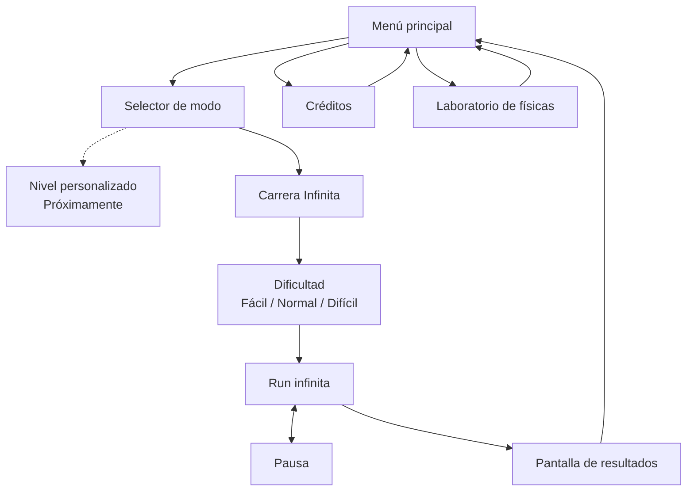

<div align="center">

# 🐢 MUDANZAS TORTUGA, S.L.

### *Servicio de Mudanzas de Don Tortuga para criaturillas del bosque desahuciadas*

**Equilibra la carga. Lee el terreno. Salva hasta el último vaso.**

<br>


<br>


<br><br>

> **«Te llevamos a tu nuevo hogar con la casa a cuestas.»**

**Anima Valencia Game Jam 2026 · FICIV Valencia**

</div>

---

## 🌲 ¿Qué es?

**Mudanzas Tortuga, S.L.** es un juego 2D de físicas simplificadas para navegador en el que Don Tortuga intenta completar una mudanza atravesando un bosque cada vez menos hospitalario.

Don Tortuga no tiene barra de vida. No explota. No se rompe. No abandona.

La que corre peligro es **la mudanza**.

El jugador regula la velocidad de avance e inclina el caparazón para intentar conservar una montaña precaria de muebles, cachivaches y objetos absurdamente delicados mientras atraviesa desniveles, impactos, trampas, cambios de terreno y agua.

```text
          🪔
         [TV]      «Todo controlado.»
      🥂 [CAJA]           \
       [SOFÁ]             🐢  → → →
══════════════════════════════════════
```

La meta no es llegar intacto.

La meta es **llegar con todo lo que todavía sea posible salvar**.

---

## 🎬 Anima Valencia Game Jam 2026

Esta versión se desarrolla para la **Anima Valencia Game Jam 2026**, celebrada dentro del **Festival Internacional de Cine Infantil de Valencia (FICIV)**, con el tema **«tortuga»**.

Página oficial del evento: <https://raccreativegames.com/es/jams/anima-valencia-26>

El objetivo mínimo de la jam incluye:

| | Objetivo |
|---|---|
| 🐢 | 1 configuración de Don Tortuga y su montaña de objetos |
| 📦 | 4 tipos de objeto físicamente diferentes |
| ♾️ | Carrera Infinita con **6 módulos** reutilizables y seed |
| 🌊 | Hierba, roca y agua; el diseño completo conserva los 4 biomas |
| ⚠️ | Rama resquebrajada, trampilla con tocón y árbol con piña |
| 🎚️ | Fácil, Normal y Difícil; trampas variables por módulo y progresión limitada |
| 🏁 | Banderines visuales, puntuación acumulada y resultados al perder toda la carga |
| 🗺️ | Nivel personalizado visible como **«Próximamente»** |

**Prototipo jugable en `dev`:** desde la portada, elige Carrera Infinita y Fácil, Normal o Difícil. La run comienza con un tramo seco seguro sin puntos; después mantiene las medias de **0,5 / 0,75 / 1,5 trampas** durante 5–10 módulos y las eleva gradualmente hasta aproximarse a **1 / 1,25 / 2**. Cada banderín suma su número de módulo por el valor de la carga que conservas. Perder toda la mudanza termina la carrera y abre los resultados. El [plan detallado](docs/ENDLESS_PLAN.md) conserva las decisiones y comprobaciones del prototipo.

`Esc` pausa el recorrido. Desde la pausa puedes continuar, volver a ver los controles o repetir la misma semilla; reiniciar y salir piden confirmación. La isla permite pasar por arriba nadando hacia la superficie o buscar el paso sumergido. Los gráficos son originales y simplificados, preparados para su sustitución por arte final.

El diseño completo vive en [`/docs/GDD.md`](docs/GDD.md).

El audio se activa con la primera pulsación o clic: portada y menús usan **Fixing the Farmer's Car**, Créditos y laboratorio **Patio Party**, y Carrera Infinita **Just Kidding**. Los efectos acompañan impactos, trampas, agua, ayudas, banderines y pérdidas agrupadas. Ajusta el volumen desde el dispositivo o navegador; esta entrega no tiene opciones de audio. Las pistas WAV/MP3 conservan su formato y volumen originales. La pausa detiene los efectos de juego y mantiene la música.

---

## 🕹️ Controles

### Terreno seco

| Tecla | Acción |
|---|---|
| `→` / `D` | Acelerar dentro del rango permitido |
| `←` / `A` | Reducir velocidad, sin detenerse ni retroceder |
| `↑` / `W` | Inclinar el frontal del caparazón hacia arriba |
| `↓` / `S` | Inclinar el frontal del caparazón hacia abajo |
| `Espacio` | Mantener para cargar; soltar para saltar hacia delante |

El salto se carga estando apoyado en terreno seco. Su intensidad de despegue aumenta linealmente hasta **3 segundos** por defecto; mantener Espacio más tiempo conserva el máximo y el salto siempre espera a que lo sueltes. Don Tortuga baja la cabeza mientras carga, sin barra de carga. Pausa, pérdida de foco, agua o pérdida de apoyo cancelan la carga.

En desniveles, cuerpo y caparazón siguen la inclinación del suelo; las teclas verticales permiten compensarla para estabilizar la mudanza.

El salto máximo actual despega a **8 m/s**. Si un obstáculo bloquea a Don Tortuga, la cámara lo espera al alcanzar el margen trasero; vuelve a avanzar en cuanto el salto permite librarlo. La carga y el cronómetro siguen activos durante esa espera.

### Agua

| Tecla | Acción |
|---|---|
| `←` / `A` · `→` / `D` | Regular el avance horizontal |
| `↑` / `W` · `↓` / `S` | Inclinar el caparazón y equilibrar la carga, igual que en seco |
| `Espacio` | Mantener para acelerar el ascenso hacia la superficie |

Sin carga cuesta más hundirse; conservar objetos permite alcanzar mayor profundidad. No hay botón para hundirse: la inmersión depende del peso y del impulso de entrada, que puede aumentar saltando antes de entrar. Después Don Tortuga tiende a volver hacia la superficie; Espacio ayuda a subir sin cargar un salto bajo el agua.

El agua aumenta el grip y amortigua más los pequeños desequilibrios. La carga sigue siendo independiente y puede desmoronarse ante ángulos muy inestables o choques extremadamente fuertes. La ayuda aparece al entrar en agua por primera vez en cada partida y puede repetirse desde la pausa.

Los valores exactos de velocidad, aceleración, inclinación, grip, impactos, flotación y corrientes son parámetros de *tuning*.

---

## 🧪 Physics Playground

El repositorio incluye un modo interno llamado **`physics-playground`** para afinar las físicas antes de construir el nivel definitivo.

Abre **⚙ Laboratorio de físicas** desde el menú principal: es una opción secundaria visible, seleccionable con ratón o flechas y Enter. También se conservan estos accesos para testers y colaboradores:

### Desde el menú principal

```text
Shift + P
```

### Acceso directo

```text
?mode=physics
```

Ejemplo local:

```text
http://localhost:5173/?mode=physics
```

Su objetivo es probar rápidamente:

- aceleración y frenada;
- compensación del terreno con el caparazón;
- salto cargado y aterrizaje;
- estabilidad de la carga;
- masas y centros de gravedad;
- grip asistido;
- impactos;
- pérdida individual de objetos;
- diferencias entre biomas;
- flotación y corrientes;
- parámetros de cámara y física.

**El laboratorio sigue disponible:** bucle de físicas a 60 Hz, cuatro objetos independientes, pérdida por contactos con margen de recuperación y nueve tramos diagnósticos de hierba, roca y agua, incluidos salto, pendientes máximas y espera de cámara ante una pared. Permite ajustar la física compartida con Carrera Infinita.

| Herramienta | Tecla |
|---|---|
| Reiniciar el tramo | `R` |
| Pausa / continuar | `Esc` |
| Avanzar un tick estando en pausa | `N` |
| Mostrar/ocultar colliders, contactos y centros de masa | `C` |

Los selectores permiten cambiar de escenario y comparar la mudanza completa, solo el sofá o Don Tortuga sin carga. Cambiar un parámetro reinicia la simulación conservando la pausa. «Previsualizar ayudas» prueba la misma secuencia de velocidad, caparazón, salto y natación que usa Carrera Infinita. La pestaña se pausa al ocultarse. Al final de cada tramo, reinicia para repetir.

### Ajustes permanentes y exportación

Los valores ajustables del laboratorio se cargan desde **`settings.txt`**, en la raíz del proyecto. El archivo usa líneas `clave=valor`, comentarios con `#` y punto decimal; contiene la versión del formato y las unidades de los parámetros. Puedes editarlo directamente con un editor de texto.

Para conservar un ajuste hecho en el laboratorio:

1. Guarda una copia del `settings.txt` del repositorio y de cualquier exportación anterior que quieras conservar, usando otro nombre o carpeta.
2. Pulsa **«Exportar settings»** para descargar los valores actuales. Comprueba el destino y si el navegador propone reemplazar un archivo existente.
3. Sustituye el `settings.txt` del repositorio por el archivo descargado cuando quieras adoptar esos valores.
4. Recarga la página si usas el servidor de desarrollo. Con preview o el servidor Python, ejecuta **`npm run build`** y después recarga la página.

El build incorpora esos valores: cambiar el archivo del repositorio después de construir requiere reconstruir. Los ajustes de la sesión se conservan al reiniciar el tramo; **«Restaurar settings»** recupera los valores cargados del archivo. Exportar mantiene el tramo y la pausa. Un archivo inválido muestra el parámetro que hay que corregir.

Los márgenes de movimiento son **posiciones en porcentaje desde la izquierda del laboratorio**, cuya escala de personaje es fija; los valores por defecto son **20 % y 80 %**. La **zona muerta** reserva el porcentaje indicado a cada lado del viewport de un nivel normal: el valor por defecto es **10 % por lado**, dejando el **80 % central** para la ventana física de movimiento. Cambiar la zona muerta no cambia esa ventana ni el tamaño del personaje en el laboratorio; la vista orientativa muestra el encuadre previsto. Los niveles normales calculan el zoom al cargar y lo mantienen fijo. El escalado conserva la composición apaisada 16:9.

**Altura del caparazón:** `shellPivotY`, en metros sobre el origen del cuerpo, ajusta el apoyo real y la altura inicial de la carga. Su valor por defecto vuelve a **0,30 m**; **0,42 m** reproduce la elevación anterior. Las formas y los colliders conservan sus dimensiones.

El formato actual es **`schemaVersion=2`**. Para adaptar una exportación anterior, cambia la versión a 2, sustituye `cameraZoom` por `cameraDeadZonePercent=10` y añade `shellPivotY=0.30`; conserva los demás parámetros. La zona muerta tiene una interpretación nueva y no es una conversión numérica del zoom antiguo. Las exportaciones actuales ya incluyen las claves correctas.

La guía de físicas y pruebas está en [docs/PHYSICS.md](docs/PHYSICS.md).

---

## 🧱 Stack

```text
TypeScript
   │
   ├── Vite ───────────── build / dev server
   ├── PixiJS 8 ───────── render 2D
   ├── Rapier2D ───────── físicas 2D
   └── HTML + CSS ─────── interfaz ligera
```

La versión de jam está concebida para funcionar como una aplicación estática.

El backend **no es obligatorio** para jugar. El leaderboard remoto se considera una mejora deseable y su integración queda desacoplada del núcleo del juego.

La base de servicios de la jam incluye un **catálogo estático validado** con los seis módulos y tres trampas, configuraciones versionadas de Tortuga/carga y un **Top 100 local por nivel y versión de físicas** para futuros niveles diseñados. Si el almacenamiento falla, los registros siguen disponibles durante la sesión. Se juega de forma anónima; las cuentas con correo/contraseña o Google, el editor y los rankings globales quedan para más adelante. Los récords persistentes de Carrera Infinita y la interfaz de rankings quedan pendientes. Los contratos y la evolución futura se explican en [docs/BACKEND.md](docs/BACKEND.md).

---

## 🗂️ Estructura abreviada

```text
/
├── AGENTS.md             # contrato operativo para Codex/agentes
├── README.md             # esta portada
├── CONTRIBUTING.md       # metodología y flujo Git
├── LICENSE.md            # licencia provisional
├── settings.txt          # valores ajustables por defecto
│
├── docs/
│   ├── GDD.md            # fuente de verdad del diseño
│   ├── PRD.md            # requisitos técnicos y alcance
│   ├── BACKLOG.md        # tareas, prioridades y trazabilidad
│   ├── DEPLOYMENT.md     # builds, servidor y futuro despliegue
│   ├── PHYSICS.md        # arquitectura y guía de tuning
│   ├── ASSETS.md         # contrato para repintar los placeholders
│   ├── BACKEND.md        # catálogo y servicios locales; evolución futura
│   └── ENDLESS_PLAN.md   # plan aprobado y comprobaciones de carrera infinita
│
├── public/
│   └── sprites/
│       └── {entity}/     # placeholders y arte final
│
├── src/                  # código del juego
├── tests/                # tests automatizados
└── scripts/
    ├── localServer.py    # servidor estático auxiliar
    └── pages-deploy.provisional.yml # plantilla inactiva de Pages
```

> Cada vez que se añada documentación nueva a `/docs/`, también deberá registrarse en `/AGENTS.md`.

---

## 🖍️ Arte de prototipo

El prototipo utiliza gráficos deliberadamente simples:

- formas de color sólido;
- etiquetas de texto;
- siluetas legibles;
- hitboxes sencillas.

Los assets públicos se guardan físicamente en:

```text
/public/sprites/{entity}/
```

Vite los copiará al build sin mantener una segunda copia en `/src`.

Los SVG originales combinan formas simples: la lámpara y el vaso tienen varios colliders; el sofá y la TV mantienen geometrías físicas sencillas. El fondo con parallax y el laboratorio usan formas de Pixi y HTML/CSS.

La artista puede repintar los placeholders conservando dimensiones y anclajes sin cambiar los colliders. La altura del caparazón se afina en el laboratorio, con el apoyo original como valor por defecto. Las dos poses adicionales de carga de salto conservan el registro del cuerpo. El contrato de tamaños, pivotes y animación está en [docs/ASSETS.md](docs/ASSETS.md).

### Don Tortuga

La animación final de caminar hacia la derecha está pensada como **1 segundo / 60 frames lógicos a 60 FPS**.

Cada estado del prototipo —caminar y cargar el salto— utiliza **dos keyframes distintos**. El sistema puede reutilizarlos a lo largo de los 60 frames lógicos; no es necesario crear 58 archivos duplicados. La artista podrá completar después los intermedios.

---

## 🔁 Flujo del prototipo jugable

La portada incluye **Créditos** y el acceso secundario **⚙ Laboratorio de físicas**, además de **Empezar mudanza**. Créditos muestra la dedicatoria de Mike Fieldins, el enlace de Argorias Svartha a ArtStation, la firma y el copyright con la redacción exacta definida en la sección 41.5.6 del [GDD](docs/GDD.md). El botón **Volver a la portada** y `Esc` permiten regresar; el enlace también se puede activar con el teclado.



---

## 💻 Servidor web local para pruebas

### 1. Preparar el entorno

- Node.js **22.12 o posterior**
- npm
- Un navegador moderno
- Python **3.10 o posterior**, solo para la alternativa con `scripts/localServer.py`

Abre una terminal en la **raíz del repositorio**, la carpeta que contiene `package.json`, `settings.txt` y `scripts/`. En Windows puedes abrir esa carpeta en el Explorador, escribir `powershell` en la barra de direcciones y pulsar Enter. Los siguientes comandos funcionan en PowerShell y en terminales de macOS/Linux.

Comprueba que Node y npm están disponibles:

```bash
node --version
npm --version
```

Instala las dependencias la primera vez y cuando cambie `package-lock.json`:

```bash
npm ci
```

Abre siempre el juego mediante una dirección **HTTP** del servidor. Abrir `index.html` con doble clic no inicia Vite ni carga correctamente el proyecto.

### 2. Probar cambios mientras se desarrolla

Inicia Vite con una dirección y un puerto explícitos:

```bash
npm run dev -- --port 5173 --strictPort
```

Mantén esa terminal abierta y visita:

- Menú: [http://127.0.0.1:5173/](http://127.0.0.1:5173/)
- Laboratorio: [http://127.0.0.1:5173/?mode=physics](http://127.0.0.1:5173/?mode=physics)

Vite detecta los cambios del código y de `settings.txt` y actualiza la página durante el desarrollo. Tras cambiar los valores por defecto, recarga la página para iniciar una sesión con la nueva configuración. Esta opción no necesita ejecutar un build después de cada edición.

Para detener el servidor, pulsa **Ctrl+C** en su terminal. `--strictPort` hace que un puerto ocupado produzca un error claro, en lugar de abrir el juego en otro puerto inesperadamente.

### 3. Probar el build de producción

Esta opción permite comprobar lo que se servirá como aplicación estática. Construye el juego y arranca Vite preview:

```bash
npm run build
npm run preview -- --port 4173 --strictPort
```

Abre el [menú](http://127.0.0.1:4173/) o el [laboratorio](http://127.0.0.1:4173/?mode=physics). Conserva la terminal abierta mientras haces pruebas y detén preview con **Ctrl+C**.

Preview sirve los archivos ya construidos en `dist/`: editar el código, un asset o `settings.txt` no actualiza ese build por sí solo. Para probar nuevos cambios, abre una **segunda terminal en la raíz del repositorio**, ejecuta:

```bash
npm run build
```

Espera a que termine y recarga la página del navegador. Puedes mantener el servidor abierto mientras reconstruyes.

### 4. Alternativa: servidor auxiliar con Python

`scripts/localServer.py` sirve el mismo build de producción y no necesita paquetes Python adicionales. Comprueba primero que el intérprete elegido es Python 3.10 o posterior:

```bash
python --version
```

Si usas otro nombre de intérprete, comprueba la versión con `py -3 --version` en Windows o `python3 --version` en macOS/Linux.

Después, desde la raíz del repositorio:

```bash
npm run build
python scripts/localServer.py --directory dist --port 4173
```

Si en Windows utilizas el lanzador `py`, puedes sustituir la línea del servidor por:

```powershell
py -3 scripts/localServer.py --directory dist --port 4173
```

En macOS/Linux, si el comando instalado es `python3`, utiliza:

```bash
python3 scripts/localServer.py --directory dist --port 4173
```

Abre [http://127.0.0.1:4173/?mode=physics](http://127.0.0.1:4173/?mode=physics). El helper imprime también las direcciones de acceso y se detiene con **Ctrl+C**. Usa una segunda terminal para reconstruir con `npm run build` y recarga tras finalizar, igual que con preview.

Sin `--directory` sirve el `dist/` del repositorio; una ruta relativa explícita se interpreta desde el directorio de la terminal. El servidor se enlaza a `127.0.0.1` por defecto. `--port 0` elige un puerto libre y muestra su dirección.

### 5. Si el puerto está ocupado

Detén el servidor anterior con **Ctrl+C** en su terminal o escoge otro puerto. Por ejemplo, para preview:

```bash
npm run preview -- --port 4180 --strictPort
```

Para el helper Python:

```bash
python scripts/localServer.py --directory dist --port 4180
```

En ambos casos abre [http://127.0.0.1:4180/?mode=physics](http://127.0.0.1:4180/?mode=physics). El servidor de desarrollo acepta el mismo cambio mediante `npm run dev -- --port 4180 --strictPort`.

### 6. Comprobar la ruta de GitHub Pages

Detén el servidor que estés usando en el puerto 4173 antes de iniciar este ejemplo:

```bash
npm run build:pages
python scripts/localServer.py --directory dist --port 4173 --base-path /FICIV-AnimaGameJam-MudanzasTortugaSL/
```

Abre [http://127.0.0.1:4173/FICIV-AnimaGameJam-MudanzasTortugaSL/?mode=physics](http://127.0.0.1:4173/FICIV-AnimaGameJam-MudanzasTortugaSL/?mode=physics). `build:pages` sobrescribe `dist/` con ese prefijo. Para volver a la prueba desde la raíz, detén el servidor, ejecuta `npm run build` y arranca preview o el helper sin `--base-path`.

La guía de configuración de despliegue está en [docs/DEPLOYMENT.md](docs/DEPLOYMENT.md).

### Checks automatizados

```bash
npm run typecheck
npm run lint
npm run test
npm run build
```

Los tests del helper son independientes de npm:

```bash
python -m unittest discover -s tests/python -v
```

---

## 🚀 Despliegue

El objetivo inicial es **GitHub Pages**.

```text
feature/* ── squash ──▶ dev ── autorización humana ──▶ main ──▶ GitHub Pages
```

- `dev` es la rama experimental de integración.
- `main` es la rama estable destinada al despliegue.
- los agentes **no deben llevar cambios de `dev` a `main` sin autorización expresa**;
- `npm run build:pages` configura el subdirectorio de este repositorio;
- los assets de `/public/sprites/` se resolverán mediante una ruta compatible con `import.meta.env.BASE_URL`.

La plantilla provisional está en [`scripts/pages-deploy.provisional.yml`](scripts/pages-deploy.provisional.yml). Permanece **inactiva** en `/scripts/`: no se publicará hasta cerrar las artes y licencias y autorizar la release. Cuando se active, el despliegue será manual desde `main`. Vite permite probar el build localmente con `npm run preview`; no es un proveedor de hosting remoto. La guía detallada está en [`/docs/DEPLOYMENT.md`](docs/DEPLOYMENT.md).

---

## 🌿 Contribuir

Las features nacen desde `dev` y vuelven a `dev` mediante **squash merge**, pero sus ramas auxiliares **se conservan**.

Así mantenemos:

- un historial limpio de integración en `dev`;
- el historial detallado de cada feature;
- las aportaciones de humanos, agentes y subagentes;
- contexto útil para futuros fixes o iteraciones.

Consulta [`CONTRIBUTING.md`](CONTRIBUTING.md) antes de trabajar con ramas, commits o merges.

---

## 📚 Documentación

- [`docs/GDD.md`](docs/GDD.md) — diseño del juego y fuente de verdad.
- [`docs/PRD.md`](docs/PRD.md) — arquitectura, stack, requisitos y alcance.
- [`docs/BACKLOG.md`](docs/BACKLOG.md) — prioridades y seguimiento.
- [`docs/DEPLOYMENT.md`](docs/DEPLOYMENT.md) — builds, servidor y despliegue.
- [`docs/PHYSICS.md`](docs/PHYSICS.md) — arquitectura de físicas y tuning.
- [`docs/ASSETS.md`](docs/ASSETS.md) — guía de repintado para la artista.
- [`docs/SOUNDS.md`](docs/SOUNDS.md) — pistas seleccionadas, eventos, reproducción y verificación del audio.
- [`docs/BACKEND.md`](docs/BACKEND.md) — catálogo, ranking local, juego anónimo y futura migración remota.
- [`docs/ENDLESS_PLAN.md`](docs/ENDLESS_PLAN.md) — plan de implementación de Carrera Infinita para revisar.
- [`AGENTS.md`](AGENTS.md) — mapa operativo completo para Codex y otros agentes.

---

## ⚖️ Licencia

El proyecto tiene licencias distintas para el código, el arte y el audio, descritas en [`LICENSE.md`](LICENSE.md).

Las grabaciones de Audio Hero conservan sus condiciones de uso y no se relicencian como código. No debe añadirse ningún recurso de terceros sin comprobar sus condiciones de uso y atribución.

---

<div align="center">

### 🐢 Mudanzas Tortuga, S.L.

**Lento no significa tarde.**

</div>
