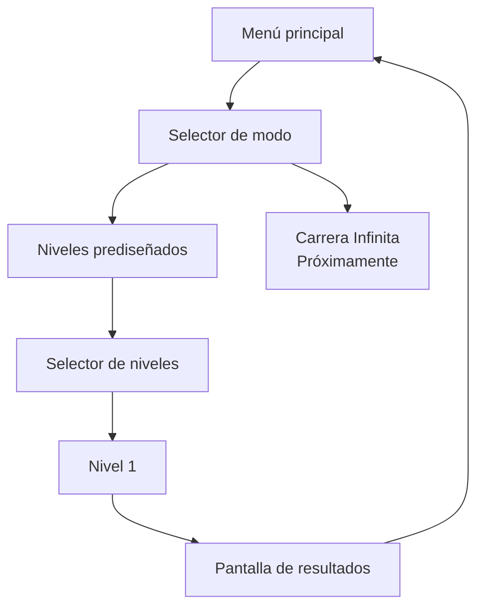

<div align="center">

# 🐢 MUDANZAS TORTUGA, S.L.

### *Servicio de Mudanzas de Don Tortuga para criaturillas del bosque desahuciadas*

**Equilibra la carga. Lee el terreno. Salva hasta el último vaso.**

<br>


<br>


<br><br>

> **«Te llevamos a tu nuevo hogar con la casa a cuestas.»**

**Anima Valencia Game Jam 2026 · FICIV Valencia**

</div>

---

## 🌲 ¿Qué es?

**Mudanzas Tortuga, S.L.** es un juego 2D de físicas simplificadas para navegador en el que Don Tortuga intenta completar una mudanza atravesando un bosque cada vez menos hospitalario.

Don Tortuga no tiene barra de vida. No explota. No se rompe. No abandona.

La que corre peligro es **la mudanza**.

El jugador regula la velocidad de avance e inclina el caparazón para intentar conservar una montaña precaria de muebles, cachivaches y objetos absurdamente delicados mientras atraviesa desniveles, impactos, trampas, cambios de terreno y agua.

```text
          🪔
         [TV]      «Todo controlado.»
      🥂 [CAJA]           \
       [SOFÁ]             🐢  → → →
══════════════════════════════════════
```

La meta no es llegar intacto.

La meta es **llegar con todo lo que todavía sea posible salvar**.

---

## 🎬 Anima Valencia Game Jam 2026

Esta versión se desarrolla para la **Anima Valencia Game Jam 2026**, celebrada dentro del **Festival Internacional de Cine Infantil de Valencia (FICIV)**, con el tema **«tortuga»**.

Página oficial del evento: <https://raccreativegames.com/es/jams/anima-valencia-26>

El objetivo mínimo de la jam incluye:

| | Objetivo |
|---|---|
| 🐢 | 1 configuración de Don Tortuga y su montaña de objetos |
| 📦 | 4 tipos de objeto físicamente diferentes |
| 🗺️ | 1 nivel prediseñado construido mediante módulos reutilizables |
| 🌊 | Al menos 3 biomas, incluyendo agua |
| ⚠️ | Al menos 2 tipos de trampa; 3 como objetivo |
| 🏁 | Meta, puntuación y pantalla de resultados |
| ♾️ | Carrera Infinita visible como **«Próximamente»** si no llega a implementarse |

El diseño completo vive en [`/docs/GDD.md`](docs/GDD.md).

---

## 🕹️ Controles

### Terreno seco

| Tecla | Acción |
|---|---|
| `→` | Acelerar dentro del rango permitido |
| `←` | Reducir velocidad, sin detenerse ni retroceder |
| `↑` | Inclinar el frontal del caparazón hacia arriba |
| `↓` | Inclinar el frontal del caparazón hacia abajo |

### Agua

| Tecla | Acción |
|---|---|
| `←` / `→` | Regular el avance horizontal |
| `↑` / `↓` | Nadar verticalmente |

Los valores exactos de velocidad, aceleración, inclinación, grip, impactos, flotación y corrientes son parámetros de *tuning*.

---

## 🧪 Physics Playground

El repositorio incluye un modo interno llamado **`physics-playground`** para afinar las físicas antes de construir el nivel definitivo.

No aparece como opción normal de la interfaz, pero testers y colaboradores pueden abrirlo de dos formas:

### Desde el menú principal

```text
Shift + P
```

### Acceso directo

```text
?mode=physics
```

Ejemplo local:

```text
http://localhost:5173/?mode=physics
```

Su objetivo es probar rápidamente:

- aceleración y frenada;
- inclinación del caparazón;
- estabilidad de la carga;
- masas y centros de gravedad;
- grip asistido;
- impactos;
- pérdida individual de objetos;
- diferencias entre biomas;
- flotación y corrientes;
- parámetros de cámara y física.

**El prototipo 1 ya está disponible:** bucle de físicas a 60 Hz, cuatro objetos independientes, pérdida por contactos con margen de recuperación y cinco tramos diagnósticos de hierba, roca y agua. Todavía no contiene niveles reales, trampas, puntuación ni resultados.

| Herramienta | Tecla |
|---|---|
| Reiniciar el tramo | `R` |
| Pausa / continuar | `Esc` |
| Avanzar un tick estando en pausa | `N` |
| Mostrar/ocultar colliders, contactos y centros de masa | `D` |

Los selectores permiten cambiar de escenario y comparar la mudanza completa con solo el sofá. Cambiar un parámetro reinicia la simulación conservando la pausa; «Restaurar valores base» deshace el tuning de la sesión. La pestaña se pausa al ocultarse. Al final de cada tramo, reinicia para repetir.

La guía de físicas y pruebas está en [docs/PHYSICS.md](docs/PHYSICS.md).

---

## 🧱 Stack

```text
TypeScript
   │
   ├── Vite ───────────── build / dev server
   ├── PixiJS 8 ───────── render 2D
   ├── Rapier2D ───────── físicas 2D
   └── HTML + CSS ─────── interfaz ligera
```

La versión de jam está concebida para funcionar como una aplicación estática.

El backend **no es obligatorio** para jugar. El leaderboard remoto se considera una mejora deseable y su integración queda desacoplada del núcleo del juego.

---

## 🗂️ Estructura abreviada

```text
/
├── AGENTS.md             # contrato operativo para Codex/agentes
├── README.md             # esta portada
├── CONTRIBUTING.md       # metodología y flujo Git
├── LICENSE.md            # licencia provisional
│
├── docs/
│   ├── GDD.md            # fuente de verdad del diseño
│   ├── PRD.md            # requisitos técnicos y alcance
│   ├── BACKLOG.md        # tareas, prioridades y trazabilidad
│   ├── DEPLOYMENT.md     # builds, servidor y futuro despliegue
│   ├── PHYSICS.md        # arquitectura y guía de tuning
│   └── ASSETS.md         # contrato para repintar los placeholders
│
├── public/
│   └── sprites/
│       └── {entity}/     # placeholders y arte final
│
├── src/                  # código del juego
├── tests/                # tests automatizados
└── scripts/
    └── localServer.py    # servidor estático auxiliar
```

> Cada vez que se añada documentación nueva a `/docs/`, también deberá registrarse en `/AGENTS.md`.

---

## 🖍️ Arte de prototipo

El prototipo utiliza gráficos deliberadamente simples:

- formas de color sólido;
- etiquetas de texto;
- siluetas legibles;
- hitboxes sencillas.

Los assets públicos se guardan físicamente en:

```text
/public/sprites/{entity}/
```

Vite los copiará al build sin mantener una segunda copia en `/src`.

Los siete SVG originales combinan formas simples: la lámpara y el vaso tienen varios colliders; el sofá y la TV mantienen geometrías físicas sencillas. El fondo con parallax y el laboratorio usan formas de Pixi y HTML/CSS.

La artista puede repintar los placeholders conservando dimensiones y anclajes sin cambiar los colliders. El contrato de tamaños, pivotes y animación está en [docs/ASSETS.md](docs/ASSETS.md).

### Don Tortuga

La animación final de caminar hacia la derecha está pensada como **1 segundo / 60 frames lógicos a 60 FPS**.

Para el prototipo solo son necesarios **dos keyframes distintos**. El sistema puede reutilizarlos a lo largo de los 60 frames lógicos; no es necesario crear 58 archivos duplicados. La artista podrá completar después los intermedios.

---

## 🔁 Flujo previsto para el siguiente prototipo



---

## 💻 Desarrollo local

### Requisitos

- Node.js **22.12 o posterior**
- npm
- Python 3 únicamente si se desea utilizar el servidor auxiliar de `/scripts/`

### Instalación

```bash
npm ci
npm run dev
```

Vite mostrará la dirección local, normalmente similar a:

```text
http://localhost:5173/
```

### Checks

```bash
npm run typecheck
npm run lint
npm run test
npm run build
```

### Probar el build de producción

Opción recomendada:

```bash
npm run build
npm run preview
```

Servidor auxiliar:

```bash
npm run build
python scripts/localServer.py --directory dist --port 4173
```

El servidor ya es funcional. Sin `--directory` sirve el `dist/` del repositorio; con una ruta relativa usa el directorio actual. Se enlaza a `127.0.0.1` por defecto y se detiene con `Ctrl+C`. `--port 0` elige un puerto libre y muestra la URL.

Para simular la ruta de GitHub Pages:

```bash
npm run build:pages
python scripts/localServer.py --directory dist --port 4173 --base-path /FICIV-AnimaGameJam-MudanzasTortugaSL/
```

Abre `http://127.0.0.1:4173/FICIV-AnimaGameJam-MudanzasTortugaSL/?mode=physics`. Este comando sobrescribe `dist/`; vuelve a ejecutar `npm run build` para servir desde la raíz.

Los tests del helper son independientes de npm:

```bash
python -m unittest discover -s tests/python -v
```

---

## 🚀 Despliegue

El objetivo inicial es **GitHub Pages**.

```text
feature/* ── squash ──▶ dev ── autorización humana ──▶ main ──▶ GitHub Pages
```

- `dev` es la rama experimental de integración.
- `main` es la rama estable destinada al despliegue.
- los agentes **no deben llevar cambios de `dev` a `main` sin autorización expresa**;
- `npm run build:pages` configura el subdirectorio de este repositorio;
- los assets de `/public/sprites/` se resolverán mediante una ruta compatible con `import.meta.env.BASE_URL`.

El workflow de publicación en GitHub Pages queda pendiente para la fase de release. La guía detallada está en [`/docs/DEPLOYMENT.md`](docs/DEPLOYMENT.md).

---

## 🌿 Contribuir

Las features nacen desde `dev` y vuelven a `dev` mediante **squash merge**, pero sus ramas auxiliares **se conservan**.

Así mantenemos:

- un historial limpio de integración en `dev`;
- el historial detallado de cada feature;
- las aportaciones de humanos, agentes y subagentes;
- contexto útil para futuros fixes o iteraciones.

Consulta [`CONTRIBUTING.md`](CONTRIBUTING.md) antes de trabajar con ramas, commits o merges.

---

## 📚 Documentación

- [`docs/GDD.md`](docs/GDD.md) — diseño del juego y fuente de verdad.
- [`docs/PRD.md`](docs/PRD.md) — arquitectura, stack, requisitos y alcance.
- [`docs/BACKLOG.md`](docs/BACKLOG.md) — prioridades y seguimiento.
- [`docs/DEPLOYMENT.md`](docs/DEPLOYMENT.md) — builds, servidor y despliegue.
- [`docs/PHYSICS.md`](docs/PHYSICS.md) — arquitectura de físicas y tuning.
- [`docs/ASSETS.md`](docs/ASSETS.md) — guía de repintado para la artista.
- [`AGENTS.md`](AGENTS.md) — mapa operativo completo para Codex y otros agentes.

---

## ⚖️ Licencia

La licencia está **provisionalmente definida** durante el arranque de la jam y se explica en [`LICENSE.md`](LICENSE.md).

El código, los assets propios y el futuro audio pueden acabar sujetos a licencias distintas. No debe añadirse ningún recurso de terceros sin comprobar sus condiciones de uso y atribución.

---

<div align="center">

### 🐢 Mudanzas Tortuga, S.L.

**Lento no significa tarde.**

</div>
