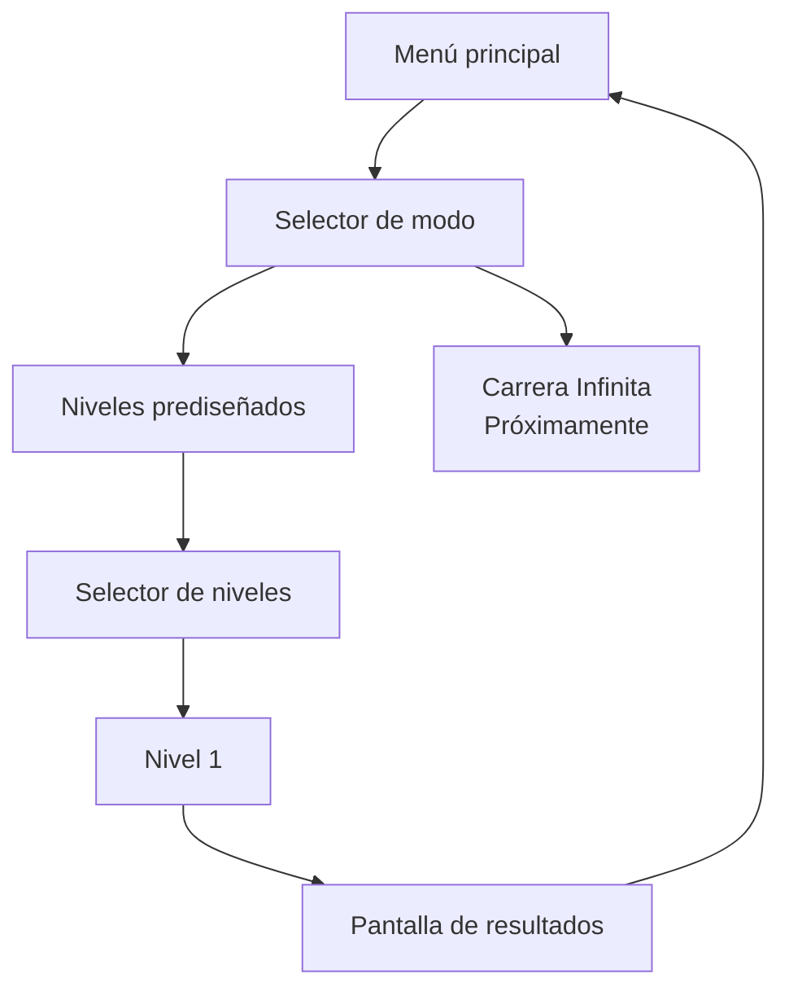

<div align="center">

# 🐢 MUDANZAS TORTUGA, S.L.

### *Servicio de Mudanzas de Don Tortuga para criaturillas del bosque desahuciadas*

> **«Te llevamos a tu nuevo hogar con la casa a cuestas.»**

**Anima Valencia Game Jam 2026 · FICIV Valencia**

</div>

---

## 🌲 ¿Qué es?

**Mudanzas Tortuga, S.L.** es un juego 2D de físicas simplificadas para navegador en el que Don Tortuga intenta completar una mudanza atravesando un bosque cada vez menos hospitalario.

Don Tortuga no tiene barra de vida. No explota. No se rompe. No abandona.

La que corre peligro es **la mudanza**.

El jugador regula la velocidad de avance e inclina el caparazón para intentar conservar una montaña precaria de muebles, cachivaches y objetos absurdamente delicados mientras atraviesa desniveles, impactos, trampas, cambios de terreno y agua.

```text
          🪔
         [TV]      «Todo controlado.»
      🥂 [CAJA]           \
       [SOFÁ]             🐢  → → →
══════════════════════════════════════
```

La meta no es llegar intacto.

La meta es **llegar con todo lo que todavía sea posible salvar**.

---

## 🎬 Anima Valencia Game Jam 2026

Esta versión se desarrolla para la **Anima Valencia Game Jam 2026**, celebrada dentro del **Festival Internacional de Cine Infantil de Valencia (FICIV)**, con el tema **«tortuga»**.

Página oficial del evento: <https://raccreativegames.com/es/jams/anima-valencia-26>

El objetivo mínimo de la jam incluye:

| | Objetivo |
|---|---|
| 🐢 | 1 configuración de Don Tortuga y su montaña de objetos |
| 📦 | 4 tipos de objeto físicamente diferentes |
| 🗺️ | 1 nivel prediseñado construido mediante módulos reutilizables |
| 🌊 | Al menos 3 biomas, incluyendo agua |
| ⚠️ | Al menos 2 tipos de trampa; 3 como objetivo |
| 🏁 | Meta, puntuación y pantalla de resultados |
| ♾️ | Carrera Infinita visible como **«Próximamente»** si no llega a implementarse |

El diseño completo vive en [`/docs/GDD.md`](docs/GDD.md).

---

## 🕹️ Controles previstos

### Terreno seco

| Tecla | Acción |
|---|---|
| `→` | Acelerar dentro del rango permitido |
| `←` | Reducir velocidad, sin detenerse ni retroceder |
| `↑` | Inclinar el frontal del caparazón hacia arriba |
| `↓` | Inclinar el frontal del caparazón hacia abajo |

### Agua

| Tecla | Acción |
|---|---|
| `←` / `→` | Regular el avance horizontal |
| `↑` / `↓` | Nadar verticalmente |

Los valores exactos de velocidad, aceleración, inclinación, grip, impactos, flotación y corrientes son parámetros de *tuning*.

---

## 🧪 Physics Playground

El repositorio incluye un modo interno llamado **`physics-playground`** para afinar las físicas antes de construir el nivel definitivo.

No aparece como opción normal de la interfaz, pero testers y colaboradores pueden abrirlo de dos formas:

### Desde el menú principal

```text
Shift + P
```

### Acceso directo

```text
?mode=physics
```

Ejemplo local:

```text
http://localhost:5173/?mode=physics
```

Su objetivo es probar rápidamente:

- aceleración y frenada;
- inclinación del caparazón;
- estabilidad de la carga;
- masas y centros de gravedad;
- grip asistido;
- impactos;
- pérdida individual de objetos;
- diferencias entre biomas;
- flotación y corrientes;
- parámetros de cámara y física.

**El primer build funcional del proyecto estará dedicado a este modo** antes de construir el nivel de la jam.

---

## 🧱 Stack

```text
TypeScript
   │
   ├── Vite ───────────── build / dev server
   ├── PixiJS 8 ───────── render 2D
   ├── Rapier2D ───────── físicas 2D
   └── HTML + CSS ─────── interfaz ligera
```

La versión de jam está concebida para funcionar como una aplicación estática.

El backend **no es obligatorio** para jugar. El leaderboard remoto se considera una mejora deseable y su integración queda desacoplada del núcleo del juego.

---

## 🗂️ Estructura abreviada

```text
/
├── AGENTS.md             # contrato operativo para Codex/agentes
├── README.md             # esta portada
├── CONTRIBUTING.md       # metodología y flujo Git
├── LICENSE.md            # licencia provisional
│
├── docs/
│   ├── GDD.md            # fuente de verdad del diseño
│   ├── PRD.md            # requisitos técnicos y alcance
│   ├── BACKLOG.md        # tareas, prioridades y trazabilidad
│   └── DEPLOYMENT.md     # despliegue (placeholder inicial)
│
├── public/
│   └── sprites/
│       └── {entity}/     # placeholders y arte final
│
├── src/                  # código del juego
├── tests/                # tests automatizados
└── scripts/
    └── localServer.py    # servidor estático auxiliar
```

> Cada vez que se añada documentación nueva a `/docs/`, también deberá registrarse en `/AGENTS.md`.

---

## 🖍️ Arte de prototipo

En el primer prototipo se utilizarán gráficos deliberadamente simples:

- formas de color sólido;
- etiquetas de texto;
- siluetas legibles;
- hitboxes sencillas.

Los assets públicos se guardan físicamente en:

```text
/public/sprites/{entity}/
```

Vite los copiará al build sin mantener una segunda copia en `/src`.

La idea es que estos placeholders sirvan también como guía para que el arte final pueda sustituirlos o «pintarse encima» sin rehacer las físicas.

### Don Tortuga

La animación final de caminar hacia la derecha está pensada como **1 segundo / 60 frames lógicos a 60 FPS**.

Para el prototipo solo son necesarios **dos keyframes distintos**. El sistema puede reutilizarlos a lo largo de los 60 frames lógicos; no es necesario crear 58 archivos duplicados. La artista podrá completar después los intermedios.

---

## 🔁 Flujo mínimo del juego



---

## 💻 Desarrollo local

### Requisitos

- Node.js LTS
- npm
- Python 3 únicamente si se desea utilizar el servidor auxiliar de `/scripts/`

### Instalación

Cuando el proyecto de Vite esté inicializado:

```bash
npm install
npm run dev
```

Vite mostrará la dirección local, normalmente similar a:

```text
http://localhost:5173/
```

### Checks

Cuando los scripts correspondientes estén definidos en `package.json`:

```bash
npm run typecheck
npm run lint
npm run test
npm run build
```

### Probar el build de producción

Opción recomendada:

```bash
npm run build
npm run preview
```

Servidor auxiliar:

```bash
npm run build
python scripts/localServer.py --directory dist --port 4173
```

`localServer.py` nace como helper/placeholder y puede evolucionar según las necesidades del proyecto.

---

## 🚀 Despliegue

El objetivo inicial es **GitHub Pages**.

```text
feature/* ── squash ──▶ dev ── autorización humana ──▶ main ──▶ GitHub Pages
```

- `dev` es la rama experimental de integración.
- `main` es la rama estable destinada al despliegue.
- los agentes **no deben llevar cambios de `dev` a `main` sin autorización expresa**;
- el `base` de Vite deberá adaptarse a la URL real del repositorio;
- los assets de `/public/sprites/` se resolverán mediante una ruta compatible con `import.meta.env.BASE_URL`.

La guía detallada está en [`/docs/DEPLOYMENT.md`](docs/DEPLOYMENT.md).

---

## 🌿 Contribuir

Las features nacen desde `dev` y vuelven a `dev` mediante **squash merge**, pero sus ramas auxiliares **se conservan**.

Así mantenemos:

- un historial limpio de integración en `dev`;
- el historial detallado de cada feature;
- las aportaciones de humanos, agentes y subagentes;
- contexto útil para futuros fixes o iteraciones.

Consulta [`CONTRIBUTING.md`](CONTRIBUTING.md) antes de trabajar con ramas, commits o merges.

---

## 📚 Documentación

- [`docs/GDD.md`](docs/GDD.md) — diseño del juego y fuente de verdad.
- [`docs/PRD.md`](docs/PRD.md) — arquitectura, stack, requisitos y alcance.
- [`docs/BACKLOG.md`](docs/BACKLOG.md) — prioridades y seguimiento.
- [`docs/DEPLOYMENT.md`](docs/DEPLOYMENT.md) — despliegue/hosting.
- [`AGENTS.md`](AGENTS.md) — mapa operativo completo para Codex y otros agentes.

---

## ⚖️ Licencia

La licencia está **provisionalmente definida** durante el arranque de la jam y se explica en [`LICENSE.md`](LICENSE.md).

El código, los assets propios y el futuro audio pueden acabar sujetos a licencias distintas. No debe añadirse ningún recurso de terceros sin comprobar sus condiciones de uso y atribución.

---

<div align="center">

### 🐢 Mudanzas Tortuga, S.L.

**Lento no significa tarde.**

</div>
