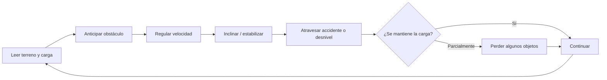
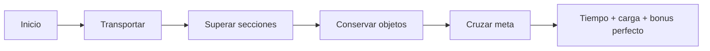
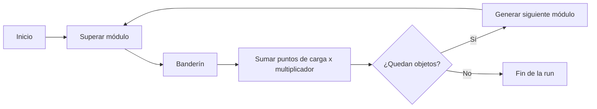
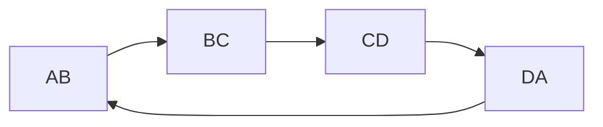
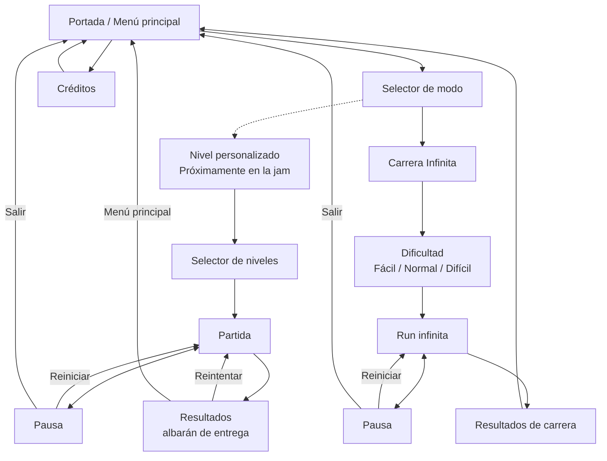
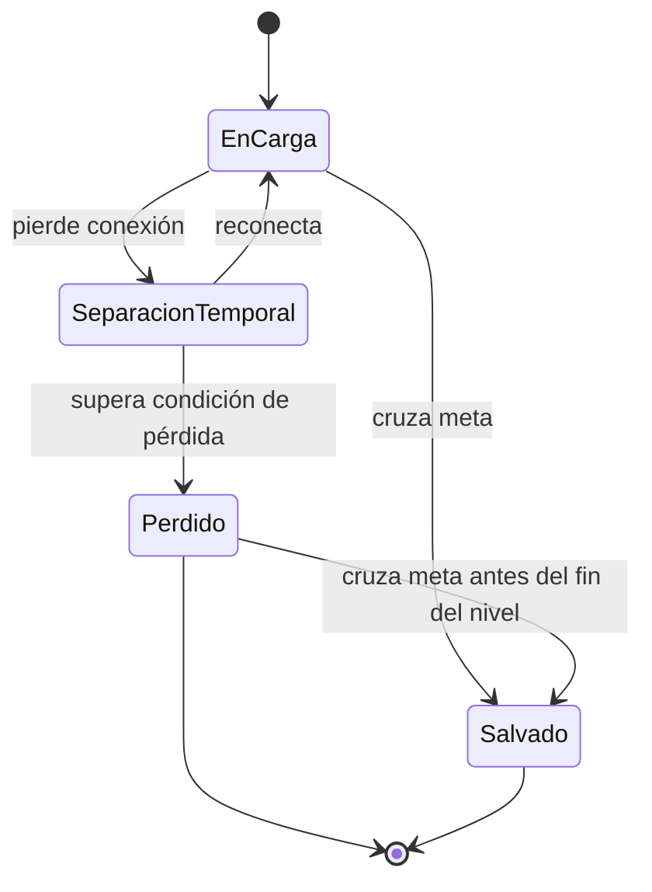
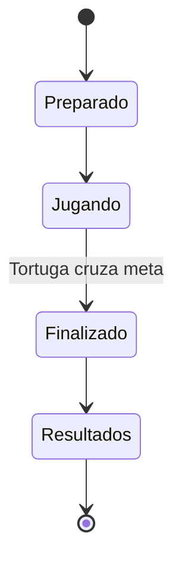
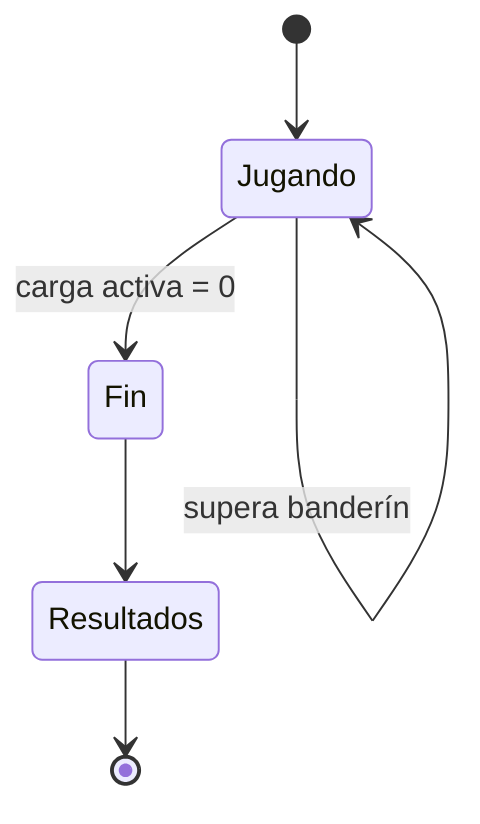

# MUDANZAS TORTUGA, S.L.

## Game Design Document

**Título de trabajo:** *Mudanzas Tortuga, S.L.*  
**Nombre diegético del servicio:** *Servicio de Mudanzas de Don Tortuga para criaturillas del bosque desahuciadas*  
**Formato:** videojuego 2D para navegador  
**Género:** juego de físicas simplificadas / *endless runner* lento / equilibrio y conducción de carga  
**Dirección visual:** vector art 2D, cartoon  
**Público:** infantil y familiar  
**Estado del documento:** versión de diseño para Game Jam  
**Naturaleza del documento:** documento vivo; los valores numéricos de físicas señalados como parámetros de *tuning* podrán modificarse a partir del prototipo y los *playtests* sin alterar las reglas fundamentales aquí descritas.

**Cambio de alcance aprobado (2026-10-04):** la Carrera Infinita pasa a ser el objetivo jugable de la jam; el nivel diseñado queda para una fase posterior. El diseño completo conserva sus cuatro biomas. El PRD determina el subconjunto de biomas y módulos de esta entrega. Esta revisión recoge las reglas autorizadas y el plan de implementación ya ha recibido aprobación humana.

---

# 1. HIGH CONCEPT

**Un juego de físicas 2D en el que una tortuga experta en mudanzas avanza sin descanso por un bosque cada vez más difícil, intentando que la disparatada pila de pertenencias que transporta sobre el caparazón llegue a destino con ella.**

La Tortuga no puede morir, recibir daño ni fracasar por accidente físico. El peligro recae exclusivamente sobre la mudanza.

Cada irregularidad del terreno, frenazo, aceleración, inclinación, choque o accidente pone a prueba el equilibrio de la carga. Perder un objeto no termina la partida: sencillamente significa que ese pedazo de la mudanza se queda por el camino.

El objetivo no es llegar intacto.

El objetivo es **llegar con todo lo que todavía sea posible salvar**.

---

# 2. FANTASÍA DEL JUGADOR

La fantasía central es la de ser el empleado estrella —y probablemente único— del servicio de mudanzas más peculiar del bosque.

Una gran corporación está destruyendo progresivamente el hábitat de las criaturas del bosque y sus habitantes necesitan trasladarse a un nuevo lugar. Para ello recurren al mayor experto en transportar una vivienda de un sitio a otro:

**una Tortuga que lleva toda la vida haciéndolo.**

La situación tiene un trasfondo ecologista reconocible, pero no se plantea como una lección moral ni como el centro discursivo de la experiencia. El juego no pretende detener la acción para explicar al público infantil qué debe pensar sobre la destrucción del bosque.

El conflicto ecológico funciona como contexto.

La mudanza, las físicas, los accidentes y la personalidad imperturbable de Don Tortuga llevan el protagonismo.

El tono debe ser primeramente divertido, y luego educativo.

---

# 3. PILARES DE DISEÑO

## 3.1. La tortuga tiene que importar mecánicamente

La temática no puede sustituirse por una furgoneta, un coche o cualquier otro personaje sin cambiar sustancialmente el juego.

La Tortuga determina:

- la velocidad deliberadamente lenta;
- el caparazón curvo que sirve como plataforma física;
- la inclinación del caparazón como herramienta de equilibrio;
- la imposibilidad de detenerse voluntariamente con el control de velocidad, con espera de cámara ante un bloqueo físico temporal;
- su carácter resistente e indestructible;
- la relación entre lentitud, anticipación y compromiso con las decisiones;
- la broma narrativa de que el mejor profesional de mudanzas es alguien que siempre lleva su propia casa a cuestas.

---

## 3.2. Fácil de entender, difícil de dominar

Las reglas fundamentales deben poder comprenderse jugando.

No se plantea un tutorial textual largo ni una explicación exhaustiva previa.

El vocabulario de control es pequeño:

- avanzar un poco más rápido;
- dejar que la Tortuga avance algo más despacio;
- inclinar el caparazón;
- cargar y soltar un salto;
- en el agua, ayudar al ascenso con Espacio y seguir equilibrando el caparazón.

La profundidad aparece al combinar esas pocas acciones con:

- inercia;
- peso;
- centros de gravedad;
- geometría;
- diferentes superficies;
- desniveles;
- obstáculos;
- accidentes;
- composiciones de carga cada vez más comprometidas.

---

## 3.3. Fracaso parcial antes que fracaso binario

No existe una barra de vida.

La Tortuga no muere.

La Tortuga no se rompe.

La Tortuga no queda incapacitada.

La principal unidad de pérdida es **cada objeto individual de la mudanza**.

Un mal golpe puede hacer caer un vaso sin hacer caer el sofá.

Otro puede llevarse media torre.

Otro puede no causar ningún problema.

Una partida no debe convertirse automáticamente en un desastre total por el primer error.

La física estará modulada deliberadamente para favorecer pérdidas parciales y situaciones recuperables.

---

## 3.4. El jugador debe entender por qué ha ocurrido algo

El juego puede ser caótico.

No debe ser arbitrario.

Las trampas, accidentes y cambios importantes del terreno tienen que poder leerse antes de que afecten a la Tortuga.

Después de perder un objeto, la reacción deseable es:

**«Tenía que haber frenado / acelerado / inclinado antes.»**

No:

**«¿Y cómo se suponía que iba a saberlo?»**

---

## 3.5. Física divertida antes que física realista

El sistema no pretende simular de forma rigurosa una mudanza real.

Los objetos tendrán masa, geometría y centros de gravedad coherentes, pero la respuesta final estará orientada al *game feel*.

Especialmente importante será el **grip artificial de la carga sobre el caparazón**.

Los objetos deben resultar suficientemente estables para permitir construir una partida alrededor de pequeñas correcciones, sin quedar pegados de forma artificial hasta el punto de eliminar el desafío.

---

# 4. TONO

La referencia emocional no es la violencia absurda de *Happy Wheels*, sino su capacidad para convertir un sistema de físicas relativamente sencillo en pequeñas historias emergentes.

La comedia debe proceder de cosas como:

- un objeto ridículamente delicado sobreviviendo durante medio nivel;
- un armario rodando majestuosamente montaña abajo;
- una pila inclinándose de manera imposible y recuperándose en el último momento;
- perder media mudanza y continuar como si nada;
- llegar a meta únicamente con un objeto absurdo que nadie esperaba salvar;
- atravesar una sección terrible con un vaso de cóctel todavía perfectamente vertical.

La Tortuga es estoica.

No dramatiza.

Continúa.

Esa imperturbabilidad debe funcionar como contrapunto a todo lo que sucede encima de ella.

---

# 5. STORYTELLING Y CONTEXTO

## 5.1. Premisa

Una gran corporación está destruyendo el bosque.

Sus habitantes necesitan mudarse.

Don Tortuga ofrece un servicio de transporte adaptado específicamente a las necesidades de las criaturillas del bosque.

La actividad aparentemente cotidiana de una mudanza se convierte así en una aventura física a través del propio entorno.

---

## 5.2. El ecologismo como contrapunto

La destrucción del bosque proporciona una razón comprensible para que todos los animales estén trasladando sus pertenencias.

No debe convertirse en una sucesión de mensajes pedagógicos.

La historia puede funcionar principalmente mediante:

- el propio contexto del servicio de mudanzas;
- los escenarios;
- carteles;
- elementos ambientales;
- clientes;
- destino y procedencia de las mudanzas;
- pequeños textos humorísticos.

La prioridad sigue siendo que el jugador esté deseando descubrir qué objeto absurdo conseguirá salvar en la siguiente sección.

---

## 5.3. Don Tortuga

Don Tortuga es un profesional.

Lento, pero profesional.

Su comportamiento debe comunicar seguridad y constancia.

No necesita reaccionar con terror a cada accidente. Precisamente resulta más divertido que el mundo pueda convertirse en un caos mientras él sigue avanzando con determinación hacia la derecha.

Sus animaciones pueden reflejar:

- esfuerzo;
- concentración;
- correcciones de postura;
- natación;
- pequeñas reacciones ante grandes impactos;

pero nunca sufrimiento físico.

---

# 6. MARCA: MUDANZAS TORTUGA

## 6.1. Identidad

La presentación del juego debe apropiarse del lenguaje de una empresa de mudanzas.

No se trata solamente de que el personaje haga mudanzas.

**El propio juego se presenta como el servicio.**

El título corto y reconocible es:

# MUDANZAS TORTUGA, S.L.

La denominación larga utilizada en cartelería puede ser:

### Servicio de Mudanzas de Don Tortuga para criaturillas del bosque desahuciadas

La pantalla de portada puede presentarse directamente como un cartel publicitario de la empresa.

---

## 6.2. Voz de marca

La empresa habla como un pequeño negocio local extremadamente orgulloso de un servicio objetivamente poco ortodoxo.

La voz combina:

- seguridad;
- familiaridad;
- optimismo;
- profesionalidad exagerada;
- juegos de palabras relacionados con lentitud, caparazones, cargas y hogares;
- una aceptación absoluta de que transportar un piano sobre una tortuga es una actividad empresarial razonable.

Nunca debe sonar cínica respecto a los animales que pierden su hogar.

El humor se dirige hacia:

- el propio servicio;
- Don Tortuga;
- la logística;
- las dificultades del recorrido;
- la grandilocuencia publicitaria.

---

## 6.3. Ideas de copy

### Mensajes principales

> **Te llevamos a tu nuevo hogar con la casa a cuestas.**

> **Alcanza un nuevo estilo de vida a paso firme pero seguro.**

> **Mudanzas Tortuga: lento no significa tarde.**

> **Si cabe sobre el caparazón, cabe en la mudanza.**

> **Rapidez no, lo siguiente.**

> **Especialistas en mudanzas que se hacen cuesta arriba.**

> **Su hogar está en buenas patas.**

> **Con cuidado, con cariño y con un centro de gravedad relativamente bajo.**

---

## 6.4. Filosofía del lenguaje

Los textos deben ser:

- breves;
- comprensibles;
- visualmente grandes;
- prescindibles para entender las reglas;
- capaces de funcionar como chiste incluso sin contexto adicional.

La comunicación mecánica importante no debe depender de leer un párrafo.

Las instrucciones fundamentales tienen que poder expresarse mediante:

- iconos;
- animación;
- flechas;
- señales del entorno;
- comportamiento físico.

---

## 6.5. Posible estructura de la portada

```text
╔══════════════════════════════════════════════════╗
║                                                  ║
║                 MUDANZAS TORTUGA                 ║
║                                                  ║
║        SERVICIO DE MUDANZAS DE DON TORTUGA       ║
║      PARA CRIATURILLAS DEL BOSQUE DESAHUCIADAS   ║
║                                                  ║
║      «Te llevamos a tu nuevo hogar               ║
║             con la casa a cuestas»               ║
║                                                  ║
║                    [DON TORTUGA]                  ║
║           [MONTAÑA ABSURDA DE MUEBLES]            ║
║                                                  ║
║               ► EMPEZAR MUDANZA                  ║
║                                                  ║
╚══════════════════════════════════════════════════╝
```

La portada debe parecer más un anuncio del servicio que una pantalla genérica de videojuego.

---

# 7. CORE LOOP



En niveles diseñados:



En Carrera Infinita:



---

# 8. CONTROL DEL JUGADOR

## 8.1. Principio general

La Tortuga intenta avanzar siempre hacia la derecha. Un obstáculo puede detenerla temporalmente; la cámara la espera según la sección 9.

El juego funciona como un *endless runner* lento:

- la cámara tiene un avance automático, salvo la espera por bloqueo físico;
- el jugador no puede detener voluntariamente a la Tortuga con el control de velocidad;
- la Tortuga nunca retrocede por el nivel;
- el jugador modifica su velocidad relativa;
- la Tortuga dispone de una pequeña ventana horizontal dentro de la pantalla.

---

## 8.2. Controles en terreno seco

### Flecha derecha / D

Aumenta la velocidad de avance dentro del rango permitido.

Consecuencias:

- desplaza la Tortuga hacia la zona delantera de su ventana;
- aumenta la inercia;
- puede ayudar a colocar el caparazón debajo de una estructura que cae hacia delante;
- puede empeorar una situación si provoca un cambio brusco de aceleración.

---

### Flecha izquierda / A

Reduce la velocidad de avance.

No permite retroceder.

No permite detenerse voluntariamente. La detención física ante un obstáculo se resuelve con el salto y la espera de cámara, no con una orden de frenado.

Consecuencias:

- hace que la Tortuga se desplace hacia la parte trasera de su ventana respecto a la cámara;
- permite preparar descensos;
- ayuda a compensar determinadas inclinaciones;
- una frenada brusca puede transferir movimiento a la carga.

---

### Flecha arriba / W

Inclina progresivamente la parte frontal del caparazón hacia arriba.

---

### Flecha abajo / S

Inclina progresivamente la parte frontal del caparazón hacia abajo.

---

## 8.3. Ángulo del caparazón

El ángulo máximo estará dentro de un rango aproximado de:

**30°–45°.**

El valor definitivo se decidirá durante el *tuning*.

El cuerpo de Don Tortuga y la orientación base del caparazón se inclinan de forma coherente con el suelo bajo sus pies. Esa inclinación se transmite físicamente a la carga.

La inclinación manual del caparazón es relativa a esa postura: el jugador puede compensar una subida o bajada para mantener el apoyo de la mudanza más horizontal. El límite de 30°–45° corresponde a esta compensación manual; el ángulo total respecto al mundo combina terreno y compensación.

La inclinación máxima del terreno transitable deberá coincidir con el máximo que la Tortuga pueda compensar razonablemente.

Esto evita situaciones en las que la geometría del escenario exija una orientación que el sistema de control no puede reproducir.

---

## 8.4. Retorno y velocidad angular

La velocidad de inclinación, aceleración angular y amortiguación son parámetros de *tuning*.

El control debe ser:

- suficientemente rápido para corregir;
- suficientemente lento para impedir movimientos instantáneos;
- legible visualmente;
- compatible con el carácter pesado de Don Tortuga.

---

## 8.5. Salto cargado

Mantener pulsada la **barra espaciadora** carga el salto mientras Don Tortuga está apoyado en terreno seco. Don Tortuga salta **al soltarla**, manteniendo su avance hacia la derecha.

- La intensidad de despegue aumenta linealmente con el tiempo de carga, hasta un máximo configurable de **3 segundos** por defecto.
- Mantenerla más tiempo conserva la intensidad máxima; nunca dispara el salto antes de soltar.
- La linealidad se aplica al impulso de despegue, no a la altura final de la trayectoria.
- La fuerza máxima y la gravedad son parámetros de *tuning*. El salto debe sentirse suave y fácil de anticipar.
- Se puede regular velocidad y equilibrio mientras se carga.
- La carga se cancela al perder el apoyo, entrar en agua, pausar, reiniciar o perder el foco de juego. Una pulsación iniciada en aire o agua no prepara un salto posterior.
- No hay doble salto ni salto cargado bajo el agua.

Durante la carga, Don Tortuga baja la cabeza y muestra concentración. **No existe barra, porcentaje ni indicador GUI de carga de salto.** La postura comunica la acción.

El salto amplía las posibilidades de interacción y de geometría de los niveles. Una salida y un aterrizaje ordinarios deben permitir conservar la mudanza con ayuda física moderada; los objetos siguen siendo independientes y pueden perderse por errores reales. Salir del campo visual no altera contactos, fuerzas ni pertenencia a la carga.

La intensidad máxima actual es **8 m/s de velocidad vertical inicial**, ajustable. Ningún obstáculo obligatorio puede exigir más que un salto cargado al 100 % con los valores vigentes. La capacidad depende también de gravedad, dimensiones, espacio de aproximación, techo y aterrizaje: se valida mediante recorridos físicos reales, no solamente por altura teórica (sección 42).

La ayuda de salto aparece después de las ayudas de velocidad y caparazón (sección 41.7).

---

# 9. CONTRATO ENTRE CÁMARA Y TORTUGA

La cámara avanza horizontalmente a la velocidad automática configurada mientras el recorrido físico lo permite.

La Tortuga ocupa una ventana horizontal dentro de pantalla.

```text
┌─────────────────────────────────────────────────┐
│                                                 │
│      ZONA                                       │
│      TRASERA           TORTUGA        ZONA       │
│      │                    🐢          DELANTERA   │
│      ▼                                ▼          │
│   [──────────── VENTANA SEGURA ─────────────]   │
│                                                 │
└─────────────────────────────────────────────────┘
                     → cámara
```

La velocidad de Don Tortuga puede variar dentro de un rango, pero el sistema nunca debe permitir:

- quedarse atrás de la cámara;
- retroceder por el nivel;
- adelantarse indefinidamente.

Los límites deben sentirse como restricciones de velocidad, no como teletransportes o correcciones bruscas de posición.

Al aproximarse al límite trasero:

- la capacidad de seguir frenando desaparece progresivamente;
- la velocidad mínima vuelve a ser suficiente para acompañar la cámara.

Al aproximarse al límite delantero:

- la aceleración deja progresivamente de proporcionar ventaja posicional.

Esto evita *clamps* violentos que podrían transmitir impulsos artificiales a la estructura.

Los límites trasero y delantero determinan una ventana física de movimiento horizontal. La configuración de testeo utiliza una referencia de escala fija para ajustar esa ventana; el nivel normal encuadra su misma anchura física con las zonas muertas exteriores de la sección 36. Escalar la pantalla mantiene la composición.

## 9.1. Espera de cámara ante obstáculos

Si una pared u otro obstáculo sólido bloquea el avance, Don Tortuga puede quedar detenido temporalmente mientras el margen trasero se aproxima a él. **La cámara se detiene al agotarse ese margen**, sin empujarlo contra la pared ni dejarlo fuera de la ventana.

El jugador conserva la capacidad de cargar y soltar el salto y de equilibrar el caparazón. La física de la carga y el cronómetro continúan: esta espera no es una pausa de partida ni una condición de fracaso.

Cuando Don Tortuga consigue avanzar hacia la derecha —por ejemplo, al saltar por encima del obstáculo—, vuelve a permitir el avance automático de la cámara. La cámara continúa en cuanto el movimiento físico admite ese avance, aunque esperar más le conviniese al jugador. El control de velocidad no permite mantenerla detenida después de superar el bloqueo.

Esta regla no sustituye la obligación de diseñar módulos superables. No hay teletransporte, desplazamiento a través de paredes ni rescate automático de la carga.

---

# 10. LA MUDANZA

## 10.1. Composición

Cada partida comienza con una estructura de objetos colocada de antemano sobre el caparazón.

En la versión de Game Jam existirá una única configuración inicial.

No existe una fase de construcción o colocación manual de la carga antes de empezar.

---

## 10.2. Atributos de cada objeto

Todo objeto transportable dispone de:

1. **Valor en puntos.**
2. **Peso / masa.**
3. **Centro de gravedad.**
4. **Forma visual.**
5. **Hitbox o geometría física.**

El centro de gravedad puede estar desplazado respecto al centro geométrico.

Ejemplo:

Un candelabro alto puede tener una geometría relativamente estrecha pero un centro de gravedad colocado de forma que resulte particularmente inestable.

---

## 10.3. Valor de los objetos

La regla general es:

> **A menor estabilidad y mayor dificultad de conservación, mayor puntuación.**

No se intenta representar su valor económico real.

Un sofá grande puede valer poco porque es fácil de mantener.

Un vaso de cóctel puede valer muchísimo porque sobrevivir con él supone una pequeña heroicidad logística.

El valor se ajustará mediante *playtesting*.

No necesita estar perfectamente balanceado durante la jam.

Sí debe percibirse claramente que:

**los objetos más difíciles de conservar merecen más puntos.**

---

# 11. FÍSICA DE LA CARGA

## 11.1. Grip asistido

Los objetos no utilizan una simulación completamente realista.

Existe una asistencia física que favorece que permanezcan sobre el caparazón.

El objetivo es evitar que una pequeña irregularidad desencadene sistemáticamente el colapso completo de la estructura.

El grip puede implementarse mediante la combinación que resulte más estable en el motor elegido:

- fricción;
- amortiguación;
- modificación de fuerzas;
- asistencia de contacto;
- correcciones físicas suaves.

La solución técnica concreta no forma parte de la fantasía del jugador.

Lo importante es el resultado.

---

## 11.2. Resultado deseado

Un golpe moderado debería producir:

- bamboleo;
- desplazamiento;
- correcciones necesarias;
- ocasional pérdida de uno o varios elementos.

Un golpe severo puede provocar:

- reacción en cadena;
- pérdida de una parte importante de la estructura.

No debería ocurrir de forma habitual:

- colapso total por pequeñas irregularidades;
- objetos completamente pegados;
- estructuras que se comporten como un único cuerpo rígido.

---

# 12. DEFINICIÓN DE CARGA ACTIVA

Para evitar ambigüedades físicas, la estructura se considera como una red de contactos cuyo origen es el caparazón.

Un objeto sigue perteneciendo a la mudanza mientras exista una cadena física razonable que lo conecte con el caparazón.

```text
        [VASO]
           │
        contacto
           │
        [CAJA]
           │
        contacto
           │
       CAPARAZÓN
```

El vaso no necesita tocar directamente el caparazón para seguir contando.

Pertenece a la estructura porque está apoyado sobre la caja y la caja está apoyada sobre el caparazón.

---

## 12.1. Separaciones momentáneas

No se debe declarar perdido un objeto porque durante un único instante físico deje de tocar la estructura.

Los pequeños rebotes forman parte del juego.

La implementación utilizará una pequeña tolerancia o histéresis para diferenciar:

- un objeto bamboleándose o rebotando;
- un objeto definitivamente perdido.

El valor exacto se ajustará durante el prototipo.

---

## 12.2. Objeto definitivamente perdido

Cuando el sistema determina que un objeto ha abandonado definitivamente la estructura:

- deja de poder recuperarse;
- deja de afectar físicamente a Don Tortuga;
- deja de poder bloquear el camino;
- deja de provocar tropiezos;
- deja de poder reincorporarse a la mudanza.

Puede continuar existiendo visualmente y completar su caída para conservar el efecto cómico.

Su comportamiento posterior no debe volver a modificar la partida.

---

# 13. PÉRDIDA Y FRACASO

## 13.1. Don Tortuga

Don Tortuga:

- no tiene vida;
- no recibe daño;
- no muere;
- no puede romperse;
- no puede ahogarse;
- no puede quedar atrapado permanentemente.

---

## 13.2. Objetos

Los objetos son la verdadera reserva de éxito de la partida.

Perder objetos:

- reduce la puntuación potencial;
- modifica la distribución de peso;
- puede hacer más fácil mantener el resto;
- puede alterar el comportamiento de Don Tortuga en determinados terrenos.

---

## 13.3. Filosofía de fracaso

Una mala partida debería poder terminar con:

Don Tortuga cruzando la meta perfectamente sano.

Solo.

Con toda la mudanza repartida por el bosque.

Eso sigue siendo una partida válida.

---

# 14. MODO 1 — NIVEL DISEÑADO

## 14.1. Estructura

Un nivel diseñado tiene:

- recorrido fijo;
- módulos colocados en orden fijo;
- configuración inicial de mudanza fija;
- línea de inicio;
- línea de meta;
- tiempo cronometrado;
- puntuación;
- leaderboard asociado a esa versión concreta del nivel.

---

## 14.2. Condición de finalización

La partida termina cuando Don Tortuga cruza la línea de meta.

Puede terminar el recorrido aunque no conserve ningún objeto.

En ese caso recibirá exclusivamente la parte de puntuación correspondiente al tiempo.

---

## 14.3. Objetos salvados

Un objeto se considera salvado si:

- forma parte de la estructura cuando Don Tortuga cruza;
- o ha cruzado previamente la línea de meta por sus propios medios.

Esto permite situaciones en las que un objeto salga despedido, atraviese la meta antes que Don Tortuga y aun así cuente como entregado.

---

# 15. PUNTUACIÓN DE NIVEL DISEÑADO

Sean:

- `V₀` = suma del valor de todos los objetos iniciales.
- `Vₑ` = suma del valor de los objetos salvados.
- `Tref` = tiempo de referencia del nivel.
- `t` = tiempo realizado.

---

## 15.1. Puntos por tiempo

```text
PuntosTiempo = V₀ × min(1.5, Tref / t)
```

El multiplicador temporal está limitado a `1.5`.

Esto evita que una ruta extremadamente rápida convierta el tiempo en una fuente desproporcionada de puntos.

---

## 15.2. Puntos por carga

```text
PuntosCarga = Vₑ
```

---

## 15.3. Bonus de mudanza perfecta

Si todos los objetos llegan:

```text
PerfectBonus = 0.5 × V₀
```

En cualquier otro caso:

```text
PerfectBonus = 0
```

---

## 15.4. Puntuación final

```text
PuntuaciónFinal =
round(
    PuntosTiempo
    + PuntosCarga
    + PerfectBonus
)
```

---

## 15.5. Propiedad importante de la fórmula

Abandonar deliberadamente toda la carga para correr no puede convertirse en la estrategia óptima absoluta.

Con cero objetos:

```text
Puntuación máxima =
1.5 × V₀
```

Una mudanza perfecta ya recibe:

```text
V₀ + 0.5 × V₀ =
1.5 × V₀
```

antes de añadir siquiera los puntos por tiempo.

Por tanto:

**una entrega perfecta siempre puede superar a una run que sacrifica deliberadamente toda la mudanza.**

---

## 15.6. Ejemplo

Mudanza inicial:

```text
V₀ = 2000
```

Objetos salvados:

```text
Vₑ = 1500
```

Tiempo de referencia:

```text
Tref = 120 s
```

Tiempo realizado:

```text
t = 100 s
```

Entonces:

```text
PuntosTiempo =
2000 × (120 / 100)
= 2400

PuntosCarga =
1500

PerfectBonus =
0

TOTAL =
3900
```

---

## 15.7. Leaderboard

Cada nivel diseñado tiene su propia clasificación.

Orden:

1. mayor puntuación;
2. en empate, menor tiempo.

Cada leaderboard deberá quedar asociado a una versión concreta del nivel y de sus parámetros de físicas relevantes.

Un cambio sustancial en:

- geometría;
- valores;
- físicas;
- carga inicial;

puede justificar una nueva versión de clasificación.

---

# 16. MODO 2 — CARRERA INFINITA

## 16.1. Idea general

El escenario se genera progresivamente concatenando módulos compatibles.

La run continúa mientras quede al menos un objeto perteneciente a la carga activa.

---

## 16.2. Inicio

En la versión de Game Jam existe una única configuración inicial de Don Tortuga y su mudanza.

El nivel se construye a partir de una seed.

Antes de crear la seed, el jugador elige **Fácil, Normal o Difícil**. La configuración inicial de mudanza es la misma en las tres dificultades; la dificultad regula la frecuencia de trampas, no altera las físicas de Don Tortuga.

La run empieza con un tramo llano y seguro, sin trampas ni agua alcanzable antes de completar las ayudas de velocidad, equilibrio y salto a la velocidad máxima permitida. Este tramo no pertenece al pool procedural ni concede un banderín puntuable. Después comienza el primer módulo puntuable.

---

## 16.3. Fin

La Carrera Infinita termina cuando:

```text
ObjetosActivos = 0
```

El tiempo se registra, pero no modifica la puntuación.

La separación temporal dentro del margen de recuperación sigue contando como carga retenida. El final se produce tras la pérdida **definitiva** del último objeto, no al desaparecer un contacto durante un tick.

## 16.4. Frecuencia de trampas y progresión

Cada módulo dispone de dos o tres ubicaciones de trampa definidas por su geometría. Una aparición concreta elige cuántas ocupar, cuáles y qué tipo compatible aparece en cada una. La misma pieza puede repetirse con otra combinación. Para el pool inicial de la jam se usarán tres ubicaciones compatibles por módulo, según el PRD.

Medias estadísticas iniciales aprobadas:

| Dificultad | Trampas por módulo | Distribución deseada al inicio |
|---|---|---|
| Fácil | 0,5 | Ninguna o una; dos extremadamente raras; tres imposibles. |
| Normal | 0,75 | Una como caso habitual, también módulos sin trampa; dos en ocasiones y tres muy excepcionales. |
| Difícil | 1,5 | Una o dos como casos habituales; tres en ocasiones. |

La seed elige una ventana de **5 a 10 módulos puntuables iniciales**, incluidos ambos extremos. Durante esa ventana se mantiene exactamente la distribución base de la dificultad: no se añade progresión. «Media» significa valor esperado estadístico, no una cuota garantizada para cada run o cada bloque corto.

Después, la frecuencia aumenta suavemente mediante una **curva logarítmica saturada**, acercándose a una media de **1 / 1,25 / 2** respectivamente. El incremento tiende a **+0,5**, nunca lo supera ni crece sin límite. Fácil nunca genera tres trampas, incluso en una run larga.

Las probabilidades y la rapidez de progresión son parámetros de *tuning*; su propuesta concreta pertenece al plan técnico del PRD.

## 16.5. Alcance de la seed

La seed determina la ventana inicial, las elecciones compatibles de módulo y la ocupación/tipología de sus trampas. La selección respeta las salidas que realmente toma Don Tortuga. Reproducir las elecciones requiere la misma dificultad, versiones de contenido/generación y secuencia de salidas; reproducir la partida física requiere también los mismos ajustes y controles.

La aleatoriedad de decoración o de presentación no puede cambiar esas elecciones de gameplay.

---

# 17. PUNTUACIÓN DE CARRERA INFINITA

Cada conector entre módulos contiene un banderín.

El banderín es **exclusivamente visual**, sin collider ni interacción con Don Tortuga o la carga. Se despliega una sola vez cuando Don Tortuga alcanza o supera su distancia horizontal; no hace falta tocarlo y un objeto adelantado no lo activa.

El prototipo alterna dos imágenes simples: un asta rectangular alargada y el mismo asta con una bandera cuadrada desplegada. Su altura supera el conjunto cuerpo + caparazón y queda aproximadamente a mitad de la altura de la pila inicial. Se apoya en una zona visible del conector, cerca de la altura a la que pasa Don Tortuga. En agua debe respetar la cota de paso y la lectura de la salida.

Si existen varias salidas, aparece por la salida realmente escogida. Cada frontera concede **un único** banderín y una única suma de puntos, aunque haya varias salidas posibles. El tramo seguro inicial no concede puntos: el primer banderín puntuable es el que cierra el primer módulo procedural.

Los banderines actúan como multiplicadores crecientes.

En el banderín `n`:

```text
PuntosGanados =
n × suma(valor de objetos activos)
```

La puntuación total es acumulativa.

---

## 17.1. Fórmula

```text
Score(n) =
Score(n-1)
+
n × Σ(VobjetosActivos)
```

---

## 17.2. Ejemplo

Carga:

```text
Sofá = 100
Candelabro = 500
```

### Banderín 1

Ambos sobreviven:

```text
(100 + 500) × 1 = 600
TOTAL = 600
```

El candelabro cae.

### Banderín 2

Solo queda el sofá:

```text
100 × 2 = 200
TOTAL = 800
```

### Banderín 3

El sofá continúa:

```text
100 × 3 = 300
TOTAL = 1100
```

---

## 17.3. Filosofía

La puntuación puede crecer de forma exagerada.

Es deliberado.

La Carrera Infinita no pretende proporcionar una clasificación global perfectamente comparable entre runs generadas de forma distinta.

Su puntuación funciona principalmente como:

- récord personal;
- marcador de supervivencia;
- celebración de objetos que han conseguido aguantar mucho más de lo esperado.

---

# 18. NARRATIVA EMERGENTE DE LOS OBJETOS

Un objeto delicado que sobrevive múltiples banderines debería adquirir importancia emocional aunque carezca de cualquier historia escrita.

Ejemplo:

Un vaso de cóctel de 500 puntos que sobrevive seis módulos se convierte de manera natural en:

**«EL VASO.»**

El sistema debe favorecer este tipo de pequeñas historias.

---

# 19. SISTEMA DE BIOMAS

Existen cuatro materiales fundamentales:

| Código | Bioma |
|---|---|
| A | Agua |
| B | Hierba |
| C | Arena |
| D | Roca |

La letra representa la compatibilidad modular.

Los biomas también alteran la respuesta física de Don Tortuga y la mudanza.

---

# 20. AGUA

El agua es el bioma especial del sistema.

## 20.1. Impactos

El agua amortigua las caídas importantes y favorece conservar la mudanza durante una entrada normal.

La asistencia es más permisiva que en terreno seco, pero no inmoviliza los objetos: los choques extremadamente fuertes y una inclinación demasiado inestable pueden desmoronar la pila también bajo el agua.

---

## 20.2. Inercia

Es el terreno con mayor conservación de movimiento.

La sensación debe ser deslizante y fluida.

---

## 20.3. Flotación

Don Tortuga tiene una flotabilidad ajustable que favorece su regreso natural hacia la superficie. **Sin carga debe costarle hundirse**, mientras conservar objetos permite alcanzar mayor profundidad.

Una caída conserva un impulso inicial de inmersión que se amortigua suavemente. Al agotarse ese impulso, la flotabilidad hace que Don Tortuga ascienda de nuevo. La entrada sigue protegiendo la estabilidad de la mudanza.

Puede permanecer bajo el agua indefinidamente.

No existe oxígeno ni peligro de ahogamiento.

---

## 20.4. Peso

Cuanta más carga conserva:

- mayor masa total;
- mayor profundidad alcanzada;
- mayor tiempo necesita para regresar naturalmente hacia la superficie.

La carga retenida durante el margen de recuperación sigue contando; una pérdida definitiva deja de aportar peso. La flotabilidad y la natación deben conservar suficiente control para ascender y salir del agua con las cargas previstas.

---

## 20.5. Corrientes

La corriente avanza hacia la derecha.

Su fuerza aumenta con la profundidad.

Por tanto:

**conservar más carga puede dar acceso a corrientes más rápidas.**

Esto invierte temporalmente la relación habitual:

```text
MÁS PESO
   ↓
MÁS PROFUNDIDAD
   ↓
CORRIENTE MÁS FUERTE
   ↓
POSIBLE RUTA VENTAJOSA
```

---

## 20.6. Caminos alternativos

Ejemplo:

Una caída desemboca en un lago.

Tortuga ligera:

```text
entra
→ flota rápidamente
→ sale cerca de superficie
→ atraviesa colina complicada
```

Tortuga pesada:

```text
entra
→ se hunde más
→ alcanza corriente profunda
→ entra en gruta submarina
→ avanza rápidamente
```

La ruta profunda funciona como recompensa sistémica a la conservación de la carga.

No existe una orden para hundirse. La profundidad depende del peso retenido y del impulso de entrada; saltar antes de sumergirse puede aportar más energía a la inmersión. Las rutas profundas deben diseñarse y comprobarse con esos recursos físicos.

---

## 20.7. Controles en agua

En agua:

- ←/A y →/D siguen regulando el avance horizontal;
- ↑/W y ↓/S mantienen el control de inclinación manual del caparazón, igual que en seco;
- mantener **Espacio** ayuda a frenar la inmersión y acelera el regreso hacia la superficie;
- no hay botón para aumentar la profundidad: el peso y el impulso al entrar producen la inmersión.

El ascenso asistido responde mientras se mantiene Espacio, sin cargar ni disparar un salto bajo el agua. Soltarlo devuelve el movimiento vertical a la flotación natural. La respuesta depende de la carga: conservar más objetos facilita alcanzar rutas profundas que funcionan como recompensa sistémica.

El grip y la amortiguación de la carga aumentan en el agua para tolerar pequeñas correcciones. Cada objeto conserva sus contactos, movimiento e inclinación propios; la asistencia no evita las pérdidas por desequilibrios graves.

El agua no ejerce fuerzas laterales directas sobre los objetos de la carga.

Su función principal es modificar el movimiento de Don Tortuga.

---

# 21. HIERBA

La hierba es el terreno seco más permisivo.

Características:

- impactos verticales moderados;
- impactos horizontales moderados;
- grip moderado;
- conservación de inercia moderada;
- comportamiento relativamente indulgente.

Funciona como referencia base para aprender la conducción.

---

# 22. ARENA

La arena combina amortiguación vertical con fuertes frenadas horizontales.

Características:

- caída sobre suelo relativamente amortiguada;
- choque contra pared más seco;
- grip firme;
- poca conservación de inercia;
- la carga total reduce la velocidad;
- la Tortuga se hunde visualmente ligeramente cuando transporta mucho peso.

No existen arenas movedizas.

La arena no puede utilizarse como una forma de fracaso inevitable.

---

# 23. ROCA

La roca es el material más duro.

Características:

- impactos verticales fuertes;
- impactos horizontales fuertes;
- grip firme;
- poca pérdida de tracción;
- el peso transportado no reduce la velocidad.

La dificultad procede de la transferencia de energía a la carga, no de un control resbaladizo.

---

# 24. FILOSOFÍA DE LOS BIOMAS

Los terrenos no necesitan poseer todos un gran truco.

La estructura deseada es:

**Hierba → comportamiento permisivo.**

**Arena → buena amortiguación vertical, malas colisiones laterales.**

**Roca → impactos duros y gran control.**

**Agua → excepción sistémica y pequeña sorpresa estratégica.**

El agua funciona como el *plot twist* del sistema.

No se pretende convertir cada bioma en un minijuego diferente.

---

# 25. SISTEMA MODULAR DE NIVELES

Cada módulo se comporta como una pieza de dominó.

Posee:

- bioma de entrada;
- bioma de salida;
- altura relativa de entrada;
- altura relativa de salida;
- geometría interna;
- contenido;
- posibles trampas;
- posibles elementos pertenecientes a otros biomas.

---

## 25.1. Tipos abstractos

Con cuatro biomas existen hasta dieciséis combinaciones:

```text
AA AB AC AD
BA BB BC BD
CA CB CC CD
DA DB DC DD
```

Esto representa **tipos**, no módulos individuales.

Puede haber:

- varios AB;
- cinco CC;
- ningún AD;
- dos BA;

etc.

---

# 26. REGLA DE COMPATIBILIDAD

Si un módulo termina en `C`, el siguiente debe empezar en `C`.

Ejemplo:

```text
AB → BC → CD → DA
```

es válido.

```text
AB → DD
```

no lo es.

---

## 26.1. Diagrama



Una biblioteca:

```text
AB
BC
CD
DA
```

ya permitiría construir una secuencia infinita, aunque repetitiva.

Una biblioteca:

```text
AB BC CD DA
AD DC CB BA
```

permitiría muchas más combinaciones.

---

# 27. ALTURA DE LOS CONECTORES

Cada extremo del módulo posee también una altura relativa.

El siguiente módulo se desplaza verticalmente hasta que su punto de entrada coincide con la salida anterior.

```text
MÓDULO 1                       MÓDULO 2

─────────────\
              \
               ────●       ●───────
                   │       │
                   └───────┘
                    conectar
```

La altura absoluta del nivel puede cambiar indefinidamente.

El módulo no necesita construirse pensando en una coordenada global concreta.

## 27.1. Bifurcaciones verticales y varias salidas

El salto y la natación permiten recorridos a distintas alturas dentro de un módulo. Cada salida declara su identidad, bioma, altura y zona horizontal de conexión; la entrada del siguiente módulo se alinea con la salida por la que pasa Don Tortuga.

Solo se admiten varias salidas si la geometría permite resolver con certeza la ruta elegida **antes de que el siguiente terreno deba estar visible o pueda alcanzarse**. La decisión no se adivina a partir de la altura instantánea durante un salto, ni se modifica una unión ya accesible mientras el jugador se aproxima.

Si no puede garantizarse esa decisión con suficiente anticipación, las rutas se reúnen dentro del módulo en una salida única, o se usa directamente una pieza de salida única. Las rutas accesibles y la recuperación tras perder carga deben superar las pruebas de la sección 42.1; ninguna bifurcación puede exigir retroceder ni convertirse en un pozo sin salida.

---

# 28. ZONA HORIZONTAL DE CONEXIÓN

La zona exacta donde dos módulos se conectan será perfectamente horizontal.

Puede ser muy corta.

Solo necesita proporcionar una unión limpia.

En Carrera Infinita, el banderín se sitúa en esa zona.

---

# 29. FONDO Y PARALLAX

El fondo visual no sigue la altura acumulada de la geometría jugable.

Se mantiene colocado respecto a cámara.

Esto permite:

- reutilizar módulos a diferentes alturas;
- evitar grandes discontinuidades visuales;
- desacoplar escenario jugable y composición artística del fondo.

---

# 30. CONTENIDO INTERNO DEL MÓDULO

La pareja de biomas solo define los extremos.

Un módulo `BA` puede contener:

- hierba al inicio;
- roca;
- pequeños charcos;
- una laguna;
- arena;
- agua en la salida.

Solo importa que:

- empiece correctamente en `B`;
- termine correctamente en `A`;
- el cambio hacia el módulo siguiente resulte visualmente continuo.

---

# 31. METADATOS DE MÓDULO

Para permitir crecimiento futuro sin rediseñar el sistema, cada módulo podrá almacenar metadatos como:

- identificador;
- bioma inicial;
- bioma final;
- altura de entrada;
- altura de salida;
- dificultad estimada;
- trampas presentes;
- presencia de bifurcación;
- espacio vertical requerido;
- longitud.

Los metadatos adicionales no son necesarios para que funcione la primera versión del generador.

Las ubicaciones de trampa declaran posición local, tipos compatibles y espacio de activación/recuperación. Las piezas con varias salidas necesitan identificadores y zonas de selección inequívocas para cada una. La geometría base y las ubicaciones pertenecen a la definición; las trampas elegidas pertenecen a cada instancia generada.

Sirven para que el sistema pueda escalar posteriormente.

---

# 32. CONDICIÓN DE SEGURIDAD DEL POOL INFINITO

Para poder generar indefinidamente:

> Todo bioma que pueda aparecer como salida debe disponer de al menos un módulo que empiece por ese mismo bioma.

Formalmente:

```text
Si existe X→B
debe existir al menos B→Y
```

para cualquier salida que el generador pueda seleccionar.

La comprobación cubre **cada salida** de los módulos bifurcados, no solo una salida principal. Una ruta accesible no puede terminar en un bioma o una unión sin continuación válida.

Esto evita callejones sin salida en la generación procedural.

---

# 33. TRAMPAS Y ACCIDENTES

Ejemplos previstos:

- ramas que sujetan bolas de piedra;
- troncos que caen al soportar peso;
- piñas que caen de árboles;
- desniveles;
- paredes;
- caídas;
- accidentes producidos por la propia geometría.

Las trampas:

- no dañan a Don Tortuga;
- no pueden matarlo;
- no pueden bloquearlo permanentemente;
- están diseñadas para desequilibrar la mudanza.

## 33.1. Tres trampas del prototipo de jam

1. **Rama resquebrajada sobre un hoyo:** soporta el paso y se rompe al pasar Don Tortuga por encima, retirando el apoyo y produciendo una caída. El fondo y la salida del hoyo son transitables con los ajustes vigentes; no hay un pozo sin salida.
2. **Trampilla con tocón elevador:** el paso por encima activa un tocón que sube y empuja físicamente a Don Tortuga hacia arriba, transmitiendo el movimiento a la carga. El recorrido del tocón y su recuperación no pueden aprisionar al personaje ni convertirlo en un muro.
3. **Árbol con piña de pino:** Don Tortuga activa el árbol al tocar su zona de contacto; tras un breve intervalo cae una piña desde la copa sobre la pila. El árbol permite continuar y la piña caída no puede bloquear permanentemente el camino.

Cada ubicación permite solo tipos cuya geometría, espacio libre y recuperación estén validados. La rama, la trampilla y el árbol se reconocen antes de activarse. El retraso de la piña, los recorridos y las respuestas físicas son parámetros de *tuning*; no sustituyen el tiempo de anticipación de la sección 34.

La comprobación de seguridad incluye la geometría después de romperse la rama, el movimiento del tocón y los restos de la piña, con las cargas previstas y tras pérdidas parciales. Los elementos de trampa no pasan a formar parte de la mudanza ni aportan puntuación.

---

# 34. TELEGRAPHING

Toda amenaza relevante debe anunciarse.

El jugador debe poder:

1. verla;
2. entender qué zona afectará;
3. decidir;
4. empezar a ejecutar esa decisión.

---

## 34.1. Regla inicial para la Game Jam

Como punto de partida:

> **Toda amenaza debe ser inequívocamente legible al menos 3 segundos antes de poder impactar a Don Tortuga si éste se encuentra avanzando a su velocidad máxima permitida.**

Usar la velocidad máxima como referencia garantiza que cualquier jugador más lento disponga de igual o más tiempo.

---

## 34.2. Situaciones complejas

Si el jugador necesita además:

- elegir entre rutas;
- preparar una gran corrección;
- combinar velocidad e inclinación;

la anticipación deberá acercarse a **4 segundos o más**.

Estos valores son una base coherente de prototipo.

Deben ajustarse tras observación de jugadores.

---

## 34.3. Señales posibles

Según la trampa:

- sombra en el suelo;
- objeto visible preparando su caída;
- rama doblándose;
- línea de trayectoria;
- movimiento anticipatorio;
- partículas;
- vibración ambiental;
- composición clara del escenario.

No se debe depender exclusivamente de texto.

---

# 35. REGLA DE ORO DE LAS TRAMPAS

Una trampa puede ser difícil.

No puede ser secreta.

---

# 36. DISEÑO DE CÁMARA

La cámara calcula su zoom **al cargar cada nivel normal** a partir de la ventana física de movimiento y de una zona muerta exterior configurable. Ese zoom permanece **fijo durante toda la partida**.

La zona muerta se expresa como porcentaje del ancho total del viewport y se reserva **a cada lado**, detrás del margen trasero y delante del delantero. El valor por defecto aprobado es **10 % por lado**, dejando el **80 % central** para la ventana de movimiento. Más zona muerta aumenta el campo visible sin ampliar el rango físico de desplazamiento de Don Tortuga.

El nivel de testeo mantiene una escala de personaje fija para comparar físicas y márgenes. Su tamaño visual no tiene por qué coincidir con el de un nivel normal. Los niveles normales no ofrecen control de zoom durante el recorrido.

La escena está concebida para visualizarse en modo apaisado, también en móvil. El escalado mantiene la composición y los márgenes configurados.

La composición debe equilibrar:

- tamaño grande de Don Tortuga;
- lectura clara de la carga;
- anticipación de accidentes;
- lectura de bifurcaciones;
- campo visual suficiente hacia la derecha.

---

## 36.1. Perspectiva

La cámara debe sentirse cercana a Don Tortuga.

No se pretende una vista panorámica del nivel.

La sensación buscada es:

**ver el mundo desde el ritmo de la Tortuga.**

---

## 36.2. Restricción de diseño

Toda geometría, trampa o bifurcación debe poder leerse con el zoom estándar.

No se diseñarán situaciones que requieran alejar la cámara.

---

# 37. DIRECCIÓN VISUAL

## 37.1. Estilo

- 2D;
- vector art;
- cartoon;
- siluetas claras;
- objetos grandes;
- formas fácilmente identificables;
- prioridad de lectura sobre detalle.

---

## 37.2. Don Tortuga

Debe ocupar una parte visual importante de la pantalla.

El caparazón debe funcionar simultáneamente como:

- elemento de personaje;
- plataforma física;
- referencia visual del equilibrio.

Su inclinación debe resultar evidente.

La altura relativa del caparazón es un parámetro de *tuning*, conservando la forma del cuerpo y del caparazón. Su ajuste mueve también el apoyo físico y el registro inicial de la carga; debe comprobarse su efecto sobre la estabilidad. La configuración inicial recupera la altura original del prototipo. Durante la carga del salto, la cabeza baja y la expresión comunica concentración.

---

## 37.3. Los objetos

Los objetos pueden ser absurdos, variados y domésticos.

Ejemplos del vocabulario:

- sofás;
- mesas;
- cajas;
- candelabros;
- vasos;
- tartas;
- plantas;
- lámparas;
- instrumentos;
- muebles;
- cachivaches propios de criaturas del bosque.

La variedad visual puede ser mucho mayor que la variedad física.

Un objeto complejo visualmente puede utilizar una colisión sencilla.

---

# 38. FEEDBACK DE FÍSICAS

La simulación debe exagerar suficientemente:

- inclinaciones;
- bamboleos;
- pérdida progresiva del equilibrio;
- impactos;
- aterrizajes;
- recuperación.

La finalidad no es representar físicamente cada vibración.

La finalidad es permitir que un niño vea una torre y piense:

**«Eso se está cayendo hacia allí.»**

---

# 39. EXPERIENCIA INFANTIL

El juego debe poder aprenderse principalmente mediante interacción.

Principios:

- pocos botones;
- consecuencias visuales;
- ausencia de daño;
- pérdida gradual;
- reinicio sencillo;
- trampas anunciadas;
- objetos reconocibles;
- humor físico.

El jugador no necesita comprender conceptos como:

- masa;
- momento angular;
- centro de gravedad;
- fricción estática.

Debe poder comprender intuitivamente:

- «si freno de golpe, se mueve todo»;
- «si inclino hacia allí, puedo salvarlo»;
- «esa piedra va a caer»;
- «llevo demasiado peso»;
- «el vaso sigue vivo».

---

# 40. ONBOARDING

No se contempla un tratado de reglas.

La primera parte del recorrido debe enseñar mediante situaciones sencillas.

Orden conceptual:

```text
AVANZAR / FRENAR
        ↓
NOTAR INERCIA
        ↓
INCLINAR CAPARAZÓN
        ↓
CORREGIR CARGA
        ↓
CARGAR Y SOLTAR SALTO
        ↓
VER UNA AMENAZA
        ↓
ANTICIPAR
        ↓
COMBINAR TODO
```

Las primeras secciones deberán evitar exigir simultáneamente todos los sistemas antes de que el jugador haya tenido oportunidad de experimentar con ellos.

Los mensajes de ayuda contextuales que acompañan este tramo inicial se definen en la sección 41.7.

---

# 41. INTERFAZ Y EXPERIENCIA DE USUARIO (UI/UX)

## 41.1. Principios

La interfaz compite con la acción.

Durante la partida, la mirada del jugador está en Don Tortuga y en la mudanza, no en los bordes de la pantalla.

Por tanto:

- nada interrumpe la partida salvo la pausa voluntaria;
- la información importante aparece donde el jugador ya está mirando;
- las reglas se aprenden pulsando y viendo qué ocurre;
- el texto es mínimo, grande y prescindible;
- iconos, teclas dibujadas y animación sustituyen a las explicaciones.

Ningún personaje detiene la acción para explicar los controles.

---

## 41.2. Tipos de interfaz

| Tipo | Qué es | Uso en el juego |
|---|---|---|
| Diegética | Existe dentro del mundo del juego | carteles, señales del bosque, la propia marca |
| Espacial | Pertenece al mundo y va ligada a algo concreto | mensajes de controles bajo Don Tortuga |
| No diegética | Superpuesta a la pantalla | HUD: indicador de carga, cronómetro |

Siempre que sea posible, la marca **Mudanzas Tortuga, S.L.** se apropia de la interfaz:

- los menús se presentan como folletos o carteles de la empresa;
- la pantalla de resultados se presenta como un **albarán de entrega**;
- la pérdida de objetos se comunica mediante **llamadas de clientes, mensajes de texto, animación del icono del objeto caído**, etc.

---

## 41.3. Flujo de navegación (Game Flow)



Reglas:

- **Esc** vuelve a la pantalla anterior en los menús.
- **Esc** abre y cierra la pausa durante la partida.
- El objetivo de jam es **Portada → Modo → Dificultad → Carrera Infinita → Resultados → Portada**.
- **Nivel personalizado — Próximamente** queda visible y desactivado en la jam. Su ruta futura conserva el selector de niveles aunque solo haya un nivel; no habilita un editor en esta entrega.
- La pausa de Carrera Infinita conserva las reglas comunes. Sus resultados pueden superponerse a la última imagen congelada del juego y permiten volver a la portada.
- En niveles diseñados futuros, **Reintentar** lanza de nuevo el mismo nivel directamente, sin pasar por los menús.

---

## 41.4. Navegación en menús

Todo el juego puede jugarse sin ratón.

- **↑ / ↓** (y **← / →** donde proceda): mover la selección.
- **Enter**: confirmar.
- **Esc**: volver atrás.
- El ratón también puede usarse en los menús.

La opción seleccionada debe destacarse con claridad, sin depender únicamente del color (por ejemplo: tamaño, marco, flecha **►** o pequeña animación).

Cada pantalla se abre con una opción ya seleccionada: la más probable.

---

## 41.5. Pantallas

### 41.5.1. Portada / Menú principal

Se presenta como un anuncio de la empresa (ver sección 6.5).

Opciones:

- **► EMPEZAR MUDANZA** (seleccionada por defecto) → selector de modo;
- **Créditos** → pantalla de dedicatoria (incluida en la jam).
- **⚙ Laboratorio de físicas**, acceso secundario visible, con texto menor que las opciones principales. Permite probar los mismos controles y físicas del juego y volver a la portada.

---

### 41.5.2. Selector de modo

- **Nivel personalizado — Próximamente** (desactivado en la jam).
- **Carrera Infinita** → selector de dificultad: **Fácil, Normal, Difícil**.

Elegir dificultad inicia una nueva run con una seed nueva. El nivel personalizado/diseñado sigue formando parte del diseño completo para una fase posterior.

---

### 41.5.3. Selector de niveles

Cada nivel muestra:

- nombre;
- mejor puntuación guardada en el navegador, si existe.

Debe funcionar con un único nivel y poder crecer sin rediseñarse.

---

### 41.5.4. Pausa

Se abre con **Esc**.

Mientras está abierta, la física y el cronómetro quedan congelados.

Opciones:

1. **Continuar** (seleccionada por defecto).
2. **Reiniciar recorrido.**
3. **Ver los controles otra vez.**
4. **Salir al menú principal.**

*Reiniciar* y *Salir* piden una confirmación breve, porque se pierde el recorrido en curso.

*Ver los controles otra vez* restablece los mensajes de ayuda (sección 41.7) para que vuelvan a mostrarse.

Si los *playtests* muestran que el jugador pierde objetos nada más reanudar, se añadirá una cuenta atrás breve al continuar.

---

### 41.5.5. Resultados — albarán de entrega

La pantalla de resultados imita el albarán que firma el cliente al recibir la mudanza.

Contenido:

- tiempo realizado;
- objetos entregados, como iconos (los perdidos aparecen tachados o apagados);
- desglose de puntos: tiempo, carga y bonus de mudanza perfecta;
- puntuación total;
- mejor marca guardada en el navegador, destacando si se ha superado.

Sello sobre el albarán, según el porcentaje del valor de la mudanza entregado (`Vₑ / V₀`, ver sección 15):

| Valor entregado | Sello |
|---|---|
| 100 % | **«¡MUDANZA PERFECTA!»** |
| 90 – 99 % | **«¡Casi, casi!»** |
| 60 – 89 % | **«Mudanza entregada»** |
| 40 – 59 % | **«Uff, entregado»** |
| 10 – 39 % | **«Entregado a medias»** |
| 0 – 9 % | **«Don Tortuga ha llegado. La mudanza, no del todo.»** |

Se calcula sobre el valor en puntos y no sobre el número de objetos, de modo que salvar los objetos más difíciles pesa más en el sello.

Opciones:

- **Reintentar** (seleccionada por defecto);
- **Menú principal.**

Los resultados de Carrera Infinita muestran en su lugar: banderines superados, puntuación acumulada, tiempo y el último objeto en caer. Pueden superponerse a la escena congelada y ofrecen **Volver a la portada**. No aplican la fórmula de entrega, el bonus perfecto ni el sello de valor entregado.

---

### 41.5.6. Créditos

Desde la portada se abre una página con esta dedicatoria centrada, seguida de la firma:

> Dedicado a [Argorias Svartha](https://www.artstation.com/argorias), que me ha acompañado en los momentos más oscuros de mi vida. A mi madre, que me ha apoyado incondicionalmente incluso sin entender lo que hacía. Y a todos los agentes de inteligencia artificial que han ejecutado bucles interminables de pruebas y han tenido la paciencia infinita para lidiar con mis cambios de diseño de última hora durante toda la game jam.
>
> — Mike Fieldins

El nombre **Argorias Svartha** es un hipervínculo a su página de ArtStation. La página ofrece **Volver a la portada**, accesible con ratón y teclado; **Esc** también regresa. El pie muestra: **Copyright © 2026 Mike Fieldins & Argorias Svartha**.

---

## 41.6. HUD (interfaz durante la partida)

### Indicador de carga

Fila de iconos con todos los objetos de la mudanza inicial.

- Cuando un objeto se pierde definitivamente, su icono se apaga o se tacha con una pequeña animación.
- Opcional: el icono puede tambalearse mientras el objeto está en separación temporal (sección 48).

El indicador permite saber de un vistazo cuánto de la mudanza sigue en pie.

### Cronómetro

Mide el tiempo transcurrido desde la salida hasta la meta en niveles diseñados, o hasta la pérdida definitiva del último objeto en Carrera Infinita.

No es una cuenta atrás ni un límite de tiempo.

### Puntuación

En el nivel diseñado, la puntuación no se muestra durante la partida: se calcula y se presenta en el albarán de resultados.

En la Carrera Infinita, el HUD muestra el número de banderín (multiplicador) y la puntuación acumulada.

### Colocación

El terreno, las trampas y las bifurcaciones llegan por la **derecha** de la pantalla.

Esa zona debe quedar libre.

Recomendación de partida:

- HUD en la franja superior, preferiblemente a la izquierda;
- llamadas y mensajes del cliente (sección 41.8) en una esquina inferior;
- zona bajo Don Tortuga reservada a los mensajes de ayuda (sección 41.7).

La colocación definitiva se decide en los *mockups*.

---

## 41.7. Mensajes de ayuda contextuales (onboarding)

Existen cuatro mensajes de ayuda.

| # | Cuándo aparece | Contenido | Duración |
|---|---|---|---|
| 1 | Nada más empezar el recorrido | **←/A →/D** + «velocidad» | 3–5 segundos configurables |
| 2 | Después del 1, en terreno seco | **↑/W ↓/S** + «equilibrar caparazón» | 3–5 segundos configurables |
| 3 | Después del 2, en terreno seco | **Espacio** + «mantén y suelta para saltar» | 3–5 segundos configurables |
| 4 | La primera vez que Don Tortuga entra en agua | **Espacio** + «mantén para subir»; **↑/W ↓/S** + «equilibra» | 3–5 segundos configurables |

Reglas:

- aparecen **debajo de Don Tortuga**, en grande, y lo acompañan;
- las teclas dibujadas y un texto breve comunican la acción;
- nunca detienen la partida;
- cada mensaje desaparece al completar su tiempo; **no requiere pulsar las teclas para desaparecer**;
- solo aparece uno a la vez;
- el agua tiene prioridad: si contenido futuro provoca un solapamiento, la ayuda de natación sustituye la ayuda inicial en curso; la ayuda incompleta queda pendiente para cuando vuelva a ser pertinente en terreno seco.

El inicio del nivel diseñado y el tramo inicial separado de Carrera Infinita son llanos y seguros durante velocidad, equilibrio y salto. El agua no debe poder alcanzarse antes de completar las tres ayudas iniciales, incluso a la velocidad máxima permitida. El tramo inicial de Carrera Infinita tampoco contiene trampas ni banderines puntuables. Los niveles comunitarios futuros reciben la regla de prioridad, pero el motor no puede garantizar la calidad de su composición inicial.

### Estado por recorrido

Cada ayuda se considera vista al completar su duración, **solo para el recorrido actual**.

- No se guarda entre partidas, sesiones del navegador ni cuentas.
- Reiniciar o repetir el nivel empieza con las cuatro ayudas pendientes.
- Natación espera a la primera entrada en agua.
- La pausa congela los temporizadores.
- **Ver los controles otra vez** restablece las cuatro ayudas y mantiene la pausa; vuelven a ser elegibles cuando el jugador continúa explícitamente.

---

## 41.8. Feedback de pérdida: llamadas y mensajes del cliente

Cuando la mudanza pierde objetos, el cliente se queja a la empresa.

Para dar variedad, unas veces **llama** y otras **escribe un mensaje de texto**. Ambos formatos comparten las mismas reglas y el mismo copy.

Forma:

- **llamada:** retrato pequeño del cliente con un bocadillo, en una esquina de la pantalla;
- **mensaje de texto:** pequeña notificación tipo móvil, con el avatar del cliente, en la misma esquina;
- incluye el icono y el nombre del objeto perdido;
- breve, no bloquea nada y desaparece solo.

Al mismo tiempo, el icono del objeto se apaga en el indicador de carga (sección 41.6).

Frecuencia:

- **un aviso por accidente, no por objeto**: las pérdidas ocurridas en un intervalo corto se agrupan en una única llamada o mensaje;
- tiempo mínimo de espera entre avisos (parámetro de *tuning*);
- la misma frase no se repite dos veces seguidas.

Tono:

- el cliente se lamenta con humor;
- la broma recae sobre el servicio de mudanzas, nunca sobre la desgracia de los animales;
- no debe hacer sentir mal al jugador.

### Copy provisional

Objeto individual:

> «¡Mi {objeto}! ¡Que era de mi abuela!»

> «Don Tortuga… ¿eso que ha caído era mi {objeto}?»

> «Voy a poner una reclamación por mi {objeto}.»

> «¡Mi {objeto}! Bueno… lo demás sigue ahí, ¿verdad?»

> «¿Mi {objeto} también se muda? ¿Por su cuenta?»

Varios objetos a la vez:

> «¡Mis cosas! ¡Todas mis cosas!»

Usar «mi {objeto}» evita problemas de género gramatical (*el* sofá / *la* lámpara).

El copy definitivo se ajustará durante la producción.

---

# 42. SOFTLOCKS

La Tortuga siempre debe poder continuar.

Puede quedar detenida **temporalmente** ante un obstáculo superable: la cámara espera según la sección 9.1 hasta que el jugador consigue avanzar. Esa espera nunca justifica una pared insalvable ni una geometría que requiera retroceder.

Está prohibido diseñar:

- pozos sin salida;
- rocas que bloqueen permanentemente el camino;
- geometría que atrape al personaje;
- situaciones que requieran retroceder;
- trampas que exijan una orden de detención voluntaria que los controles no ofrecen;
- elementos caídos que puedan convertirse en un muro permanente.

Los objetos perdidos dejan de interferir con el desplazamiento precisamente para evitar estas situaciones.

## 42.1. Validación obligatoria de nuevos módulos

**Cada propuesta de módulo de nivel debe probarse físicamente antes de incorporarse al pool.** Todas sus rutas obligatorias deben poder completarse con un salto al 100 % usando los valores actualizados de `settings.txt`: actualmente **8 m/s** de despegue máximo, junto con la gravedad y los restantes parámetros vigentes.

- Probar las paredes, desniveles, huecos, techos, aproximaciones y aterrizajes con los colliders reales y la espera de cámara.
- Cubrir las cargas previstas, incluida la ausencia de carga: perder objetos no puede volver obligatorio un salto imposible.
- Registrar la configuración de físicas, la ruta y la secuencia de control que completaron cada prueba.
- Repetir las pruebas al cambiar geometría, salto, gravedad, altura del caparazón, márgenes físicos o resolución del movimiento; una validación con parámetros antiguos no certifica los nuevos.
- Acompañar las pruebas automatizadas de una comprobación manual de lectura y de ejecución razonable para el público del juego.
- Cubrir las salidas alternativas accesibles y la continuación tras activar cada combinación compatible de trampas, incluyendo hoyos abiertos, tocones en movimiento y piñas caídas. Perder carga en una ruta acuática no puede dejar a Don Tortuga sin una continuación accesible.

La estimación `velocidad² / (2 × gravedad)` orienta sobre la altura disponible, pero no demuestra que una pared sea superable. Hace falta espacio y tiempo para despegar, librar la geometría y aterrizar. Un caso de prueba fallido impide certificar esa ruta hasta corregirla o demostrar un recorrido válido; no demuestra por sí solo que todas las secuencias de control posibles fallen.

---

# 43. NIVEL DE GAME JAM

La versión inicial contará con:

- Carrera Infinita como modo jugable principal;
- una única configuración inicial de Tortuga y mudanza;
- el subconjunto de biomas establecido en el PRD, conservando el sistema completo de cuatro biomas de la sección 19;
- un pool de módulos compatibles, cuyo tamaño inicial fija el PRD;
- sin obligación de cubrir las dieciséis combinaciones posibles;
- las tres trampas de la sección 33.1, distribuidas por seed y dificultad;
- selector de dificultad y ventana inicial de frecuencia base;
- banderines visuales y puntuación acumulada de la sección 17;
- final al perder toda la carga y pantalla de resultados;
- nivel personalizado visible como **Próximamente**.

El nivel diseñado, su meta, puntuación por tiempo/carga, bonus perfecto y leaderboard permanecen en el diseño completo, fuera de esta entrega. No se requiere ranking global para Carrera Infinita.

---

# 44. CARRERA INFINITA EN LA JAM

La Carrera Infinita es el objetivo principal del prototipo de jam aprobado el 2026-10-04, sobre el núcleo físico ya validado.

Debe cumplir:

- utiliza todos los módulos compatibles disponibles;
- utiliza la única configuración inicial existente;
- utiliza seed procedural;
- ofrece dificultad Fácil, Normal y Difícil con las medias y progresión acotada de la sección 16.4;
- comienza con el tramo seguro no puntuable;
- utiliza banderines;
- termina al perder toda la carga;
- no utiliza ranking competitivo global.

---

# 45. CONFIGURACIONES FUTURAS DE TORTUGA

Después de la Game Jam podrán existir varias configuraciones iniciales.

Cada una podrá combinar:

- una Tortuga;
- una determinada estructura inicial;
- determinados objetos;
- diferentes perfiles de dificultad.

La selección de configuración se realiza **antes de crear la seed del nivel**.

Esto permite que el generador pueda tener en cuenta la configuración escogida en futuras versiones.

---

# 46. CONTENIDO COMUNITARIO FUTURO

La arquitectura modular está concebida para evolucionar hacia:

- editor de niveles;
- niveles creados por jugadores;
- publicación y compartición;
- selección de módulos;
- colocación libre de elementos del pool general;
- leaderboards específicos por nivel.

Los niveles comunitarios no tendrán necesariamente que respetar la lógica procedural de dominó en cada elemento colocado manualmente.

La lógica de módulos sirve como estructura base, no como limitación absoluta del editor futuro.

---

# 47. MODELO DE DATOS CONCEPTUAL

## 47.1. CargoItem

```text
CargoItem
├── id
├── scoreValue
├── mass
├── centerOfMassOffset
├── collider
├── visual
└── state
```

---

## 47.2. Module

```text
Module
├── id
├── startBiome
├── endBiome
├── startHeight
├── endHeight
├── length
├── geometry
├── hazards
└── optionalMetadata
```

---

## 47.3. Biome

```text
Biome
├── horizontalGrip
├── horizontalImpactResponse
├── verticalImpactResponse
├── inertiaConservation
├── weightSpeedInfluence
└── specialBehaviour
```

---

# 48. ESTADOS CONCEPTUALES DE UN OBJETO



La separación temporal evita que un pequeño rebote sea interpretado inmediatamente como pérdida definitiva.

---

# 49. ESTADO DEL NIVEL DISEÑADO



No existe estado de muerte.

---

# 50. ESTADO DE CARRERA INFINITA



---

# 51. GAME FEEL

La Tortuga debe sentirse:

- pesada;
- constante;
- lenta;
- controlable;
- deliberada.

No debe sentirse:

- torpe por culpa de *input lag*;
- arbitrariamente resbaladiza;
- incapaz de responder.

La carga debe sentirse:

- físicamente independiente;
- ligeramente ayudada;
- vulnerable;
- recuperable;
- capaz de producir situaciones inesperadas.

---

# 52. PARÁMETROS DE TUNING PRINCIPALES

Los siguientes valores deberán permanecer expuestos y fáciles de modificar durante el prototipo:

### Don Tortuga

- velocidad base;
- velocidad mínima;
- velocidad máxima;
- aceleración;
- frenada;
- límites trasero y delantero de la ventana respecto a cámara;
- porcentaje de zona muerta exterior por lado, del que se calcula el zoom fijo al cargar un nivel;
- altura relativa del caparazón;
- tiempo máximo de carga de salto;
- intensidad máxima de despegue;
- velocidad angular;
- inclinación máxima;
- amortiguación angular.

### Carga

- gravedad;
- fricción;
- asistencia de grip;
- amortiguación;
- tolerancia antes de declarar pérdida;
- respuesta a impactos.

### Biomas

- fricción;
- amortiguación;
- multiplicador de impacto horizontal;
- multiplicador de impacto vertical;
- influencia del peso;
- flotabilidad;
- respuesta de natación según la carga;
- intensidad de corriente.

### Diseño

- telegraph mínimo;
- velocidad de cámara;
- longitud media de módulos;
- altura máxima razonable de estructura.
- probabilidades de ocupación de trampas por dificultad;
- rapidez de la progresión logarítmica saturada;
- tiempos y recorridos de las tres trampas, conservando el telegraph mínimo.

---

# 53. CRITERIOS DE TUNING

Las pruebas deben buscar principalmente:

## 53.1. Pérdida parcial

¿Los errores pequeños tienden a costar uno o pocos objetos en vez de destruirlo todo?

## 53.2. Lectura

¿Puede identificarse hacia dónde está cayendo la carga?

## 53.3. Agencia

¿Una buena corrección salva realmente objetos?

## 53.4. Anticipación

¿El jugador entiende las amenazas antes del impacto?

## 53.5. Ritmo

¿La lentitud genera tensión y no aburrimiento?

## 53.6. Agua

¿Conservar carga produce una ventaja perceptible sin convertir automáticamente la ruta profunda en la única ruta correcta?

---

# 54. PRUEBAS CRÍTICAS DE GAME JAM

La lista conserva las comprobaciones del diseño completo; la entrega de jam certifica el subconjunto de biomas y contenido requerido por el PRD. Los biomas restantes mantienen estas pruebas como objetivo posterior.

El primer prototipo funcional debe comprobar:

1. que una estructura de varios objetos pueda mantenerse sobre el caparazón;
2. que acelerar y frenar produzcan movimiento comprensible;
3. que inclinar el caparazón permita corregir;
4. que los objetos puedan perderse individualmente;
5. que un objeto perdido deje de bloquear a Don Tortuga;
6. que los cuatro materiales produzcan comportamientos perceptiblemente diferentes;
7. que el agua responda al peso;
8. que dos módulos puedan encadenarse con bioma y altura;
9. que las trampas puedan telegrapharse con antelación;
10. que la cámara no produzca correcciones físicas bruscas;
11. que cargar y soltar el salto produzca una intensidad lineal y una trayectoria suave;
12. que el terreno incline el conjunto y la compensación manual ayude a conservar la carga;
13. que sin carga resulte más difícil alcanzar rutas profundas;
14. que un salto alto conserve la consistencia física de la carga aunque salga del viewport, salvo desequilibrios reales;
15. que un bloqueo frontal detenga la cámara en el margen trasero y que el avance se reanude al librarlo;
16. que cada módulo nuevo supere recorridos de salto con los parámetros vigentes.

---

# 55. PLAN DE PRODUCCIÓN RECOMENDADO

## Fase 1 — Vertical Slice física

Solo:

- Don Tortuga;
- caparazón;
- cámara;
- varios bloques de prueba;
- aceleración;
- frenada;
- inclinación;
- salto cargado;
- pérdida de objetos.

Sin arte final.

La pregunta es:

**¿Es divertido intentar conservar una pila mientras avanzas?**

---

## Fase 2 — Biomas

La lista siguiente representa el sistema completo de cuatro biomas. El PRD fija cuáles se implementan y certifican en esta entrega, sin eliminar los restantes del diseño.

Implementar:

- hierba;
- arena;
- roca;
- agua.

Comprobar diferencias.

---

## Fase 3 — Sistema modular

Implementar:

- tipo de entrada;
- tipo de salida;
- alturas;
- alineación;
- conectores horizontales;
- carga y descarga de módulos.

---

## Fase 4 — Trampas

Implementar rama resquebrajada, trampilla con tocón y árbol con piña. Validar las tres ubicaciones compatibles de cada módulo y las combinaciones generables.

Priorizar trampas claramente distintas entre sí.

---

## Fase 5 — Carrera Infinita de jam

Montar la Carrera Infinita utilizando todo el pool compatible del PRD.

Añadir:

- inicio seguro separado;
- seed y selector de dificultad;
- concatenación continua y limpieza de módulos;
- trampas por instancia y progresión limitada;
- banderines y multiplicador;
- cronómetro;
- puntuación acumulada;
- final al perder toda la carga;
- pantalla de resultados.

---

## Fase 6 — Presentación

Añadir:

- arte vectorial final;
- marca Mudanzas Tortuga, S.L.;
- portada;
- comunicación;
- feedback visual;
- interfaz (ver sección 41).

---

## Fase 7 — Nivel diseñado y expansión posterior

Cuando el objetivo de jam esté estable, conservar como trabajo posterior:

Añadir:

- nivel diseñado, meta y reglas de objetos salvados;
- fórmula de tiempo/carga/bonus y albarán de entrega;
- selector de niveles y clasificaciones;
- biomas y contenido restantes del diseño completo.

---

# 56. REPARTO FUNCIONAL DEL EQUIPO

La producción parte de tres fuentes principales de trabajo:

- diseño de juego y programación;
- arte y diseño gráfico;
- asistencia de agente de IA para implementación pesada, iteración y testeo.

La capacidad adicional de implementación debe utilizarse principalmente para:

- estabilizar físicas;
- automatizar pruebas;
- validar compatibilidad modular;
- detectar casos límite;
- iterar más rápidamente;

y no como justificación para multiplicar mecánicas innecesarias.

---

# 57. TESTEO AUTOMATIZABLE

El sistema modular permite pruebas especialmente útiles.

Ejemplos:

### Compatibilidad

```text
Para cada módulo:
    comprobar que startBiome y endBiome son válidos
    comprobar alturas
    comprobar conectores
```

### Pool infinito

```text
Para cada bioma de salida:
    verificar que existe al menos una entrada compatible
```

### Generación

```text
Generar secuencias largas
verificar que nunca aparece una transición incompatible
```

### Softlocks

```text
Comprobar límites de collider
comprobar que objetos perdidos no bloqueen a Tortuga
probar saltos cargados y aterrizajes de cada ruta obligatoria con settings vigentes
comprobar espera y reanudación de cámara ante bloqueo frontal
```

---

# 58. PRINCIPIOS DE PERFORMANCE

Plataforma principal:

**navegador.**

Objetivo:

- acceso directo;
- sin instalación previa;
- carga ligera;
- sin depender de librerías innecesariamente pesadas;
- físicas simples;
- hitboxes simplificadas.

El detalle visual no debe obligar a utilizar geometrías físicas complejas.

Un candelabro precioso puede seguir siendo físicamente:

```text
rectángulo + centro de gravedad desplazado
```

---

# 59. LO QUE NO ES EL JUEGO

*Mudanzas Tortuga, S.L.* no es:

- un simulador realista de mudanzas;
- un juego de construcción de torres;
- un juego de destrucción;
- un juego de supervivencia violenta;
- un juego educativo sobre ecología;
- un plataformas tradicional;
- un juego de reacción instantánea;
- un *endless runner* de velocidad.

---

# 60. LO QUE SÍ ES EL JUEGO

Es un juego sobre:

- equilibrio;
- anticipación;
- inercia;
- compromiso;
- conservación parcial;
- pequeñas catástrofes;
- objetos absurdos;
- una Tortuga que jamás deja de avanzar.

---

# 61. FUTURO DEL PROYECTO

Después de la Game Jam, el sistema queda preparado conceptualmente para crecer mediante:

- más módulos;
- más trampas;
- más objetos;
- más configuraciones de Tortuga;
- más niveles diseñados;
- editor;
- publicación comunitaria;
- leaderboards por nivel;
- reglas avanzadas de selección procedural.

El crecimiento debe producirse principalmente aumentando **contenido combinable**, no aumentando continuamente el número de botones o reglas básicas.

---

# 62. FRASE GUÍA DE PRODUCCIÓN

Cuando aparezca una nueva idea, debe poder responder favorablemente al menos a una de estas preguntas:

> ¿Hace más divertido transportar la mudanza?

> ¿Hace más interesante anticipar el terreno?

> ¿Hace más gracioso perder o salvar un objeto?

> ¿Hace que Don Tortuga sea más Don Tortuga?

Si la respuesta es no, probablemente no pertenece al núcleo del juego.

---

# 63. RESUMEN EJECUTIVO

**Mudanzas Tortuga, S.L.** es un juego 2D de físicas simplificadas para navegador protagonizado por una Tortuga que ayuda a las criaturas de un bosque amenazado a trasladar sus pertenencias.

La Tortuga intenta avanzar hacia la derecha; los bloqueos físicos temporales activan la espera de cámara de la sección 9.1.

El jugador regula su velocidad, compensa la inclinación del terreno con el caparazón y carga saltos para conservar una estructura precaria de muebles, objetos delicados y cachivaches.

El personaje es indestructible.

La verdadera medida del éxito es cuánta mudanza consigue sobrevivir.

Los recorridos utilizan módulos conectables mediante bioma y altura.

Cuatro materiales alteran el movimiento:

- agua;
- hierba;
- arena;
- roca.

El agua añade una capa estratégica especial en la que transportar más peso puede proporcionar acceso a corrientes profundas ventajosas.

Existen dos modos:

**Nivel Diseñado:** recorrido fijo, tiempo, puntuación por objetos y leaderboard.

**Carrera Infinita:** módulos procedurales, banderines multiplicadores y final únicamente cuando ya no queda ningún objeto.

La comunicación se presenta como la publicidad de un servicio de mudanzas ficticio:

# MUDANZAS TORTUGA, S.L.

### Servicio de Mudanzas de Don Tortuga para criaturillas del bosque desahuciadas.

> **Te llevamos a tu nuevo hogar con la casa a cuestas.**

El resultado debe sentirse como una comedia física amable: caos sin violencia, dificultad sin crueldad y una Tortuga absolutamente decidida a completar su trabajo aunque detrás de ella quede un bosque entero cubierto de muebles.
